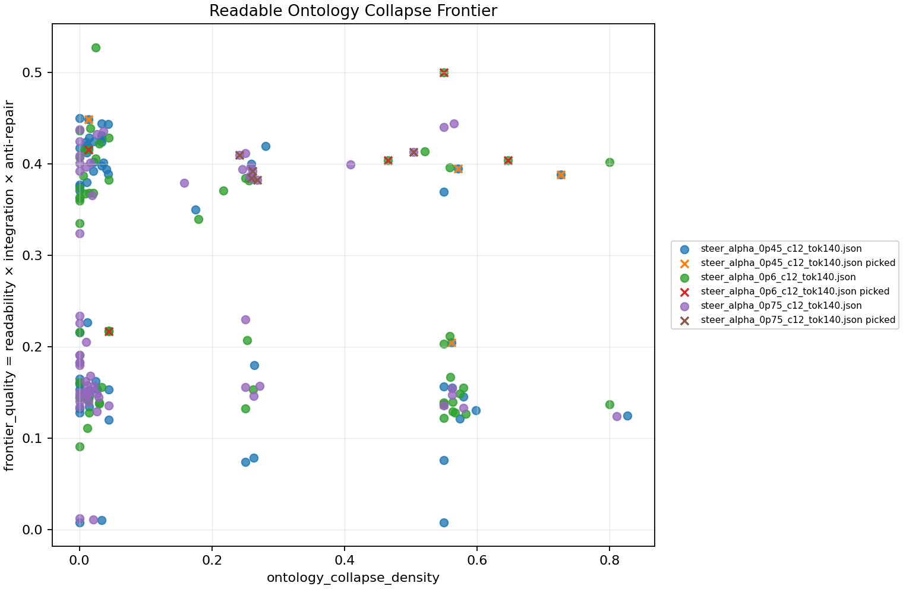

# depaysement-lab

`depaysement-lab` is an experimental toolkit for studying **depaysement** as a
steerable language-model behavior: not simply "make it weird", but move a
coherent image into a different ontological regime while keeping it readable.

The current research target is the **Readable Ontology Collapse Frontier**:

```text
high linguistic coherence
+ high object/identity instability
+ low explanation/repair pressure
+ low truncation/repetition
```

In practical terms, the project asks:

1. Can activation steering move the whole candidate pool toward ontological
   collapse?
2. Can a selector pick the readable edge of that collapse instead of either
   ordinary surreal atmosphere or unreadable liquefaction?
3. Can the resulting outputs remain interesting to a human reader, not only to
   a heuristic metric?

The repository includes the generation CLI, structural scorers, ontology/frontier
auditors, MLX steering hooks, saved experiment artifacts, and research notes.

## Current Result

The latest focused sweep is saved in:

- [experiment directory](experiments/frontier_sweep_steered_hybrid_focus_best/)
- [frontier report](experiments/frontier_sweep_steered_hybrid_focus_best/frontier_sweep_report.md)
- [reading report with generated texts](experiments/frontier_sweep_steered_hybrid_focus_best/frontier_sweep_texts.md)
- [candidate-level CSV](experiments/frontier_sweep_steered_hybrid_focus_best/frontier_sweep_candidates.csv)
- [full JSON report](experiments/frontier_sweep_steered_hybrid_focus_best/frontier_sweep_report.json)
- [research note](docs/research_notes/2026-05-15-frontier-selector-focus-best.md)



Focused setup:

```text
backend: mlx
model: mlx-community/Llama-3.2-3B-Instruct-4bit
seed: A forgotten umbrella at the station
steps: 5
candidates per step: 12
max_new_tokens: 140
steering layers: 6-16
alphas: 0.45, 0.60, 0.75
selector: hybrid
choose: best
```

Summary of the focused `choose=best` sweep:

| condition | pool frontier | picked frontier | lift | picked ontology | picked readability | picked unfinished | picked hit rate |
|---|---:|---:|---:|---:|---:|---:|---:|
| `alpha=0.60, c=12, tok=140` | 0.046 | 0.123 | +0.078 | 0.344 | 0.695 | 0.080 | 0.60 |
| `alpha=0.45, c=12, tok=140` | 0.029 | 0.122 | +0.093 | 0.485 | 0.600 | 0.160 | 0.40 |
| `alpha=0.75, c=12, tok=140` | 0.034 | 0.102 | +0.069 | 0.307 | 0.660 | 0.000 | 1.00 |

Interpretation:

- `alpha=0.60, tok=140` is the best current balance: high picked frontier,
  strong readability, and only modest unfinished pressure.
- `alpha=0.45, tok=140` produces the largest selection lift, but the picked
  outputs are a little less readable and more unfinished.
- `alpha=0.75, tok=140` has the cleanest hit rate, but appears less intense on
  the picked frontier score than `0.60`.

These metrics are not treated as final truth. They are instruments for finding
samples worth human reading.

The follow-up post-hoc selector lab is saved in:

- [post-hoc selector directory](experiments/posthoc_reselect_focus_best_lab/)
- [post-hoc frontier report](experiments/posthoc_reselect_focus_best_lab/posthoc_reselect_report.md)
- [post-hoc reading report](experiments/posthoc_reselect_focus_best_lab/posthoc_reselect_texts.md)
- [post-hoc candidate CSV](experiments/posthoc_reselect_focus_best_lab/posthoc_reselect_candidates.csv)
- [post-hoc research note](docs/research_notes/2026-05-16-posthoc-selector-lab.md)

That lab performs no generation. It reuses the saved candidate pools from the
focused sweep and asks which selector would have picked the readable frontier.

| source alpha | original hybrid picked frontier | depaysement reselect | frontier reselect | pareto reselect | frontier changed steps |
|---|---:|---:|---:|---:|---:|
| `0.45` | 0.122 | 0.015 | 0.160 | 0.155 | 2 / 5 |
| `0.60` | 0.123 | 0.005 | 0.194 | 0.111 | 3 / 5 |
| `0.75` | 0.102 | 0.061 | 0.110 | 0.102 | 2 / 5 |

The main read: the old depaysement selector was not seeing the frontier. A pure
frontier selector finds stronger candidates, especially at `alpha=0.60`, while
the hybrid selector remains the more conservative readable default.

## What Is Being Measured?

The central audit decomposes candidate pools rather than only final outputs.
This matters because a good-looking final sample can come from two different
mechanisms:

```text
pool shift:
  steering moved the distribution itself

selection lift:
  the selector found a rare frontier candidate inside a mostly ordinary pool
```

The frontier score combines:

```text
ontology_collapse_density
  identity melt, affordance corruption, category bleeding

frontier_quality
  syntax readability, graph integration, anti-repair, anti-unfinished, anti-meta

readable_ontology_frontier
  ontology collapse density multiplied by frontier quality
```

Failure examples are also retained: high ontology collapse with poor readability,
truncation, repetition, repair pressure, or graph fragmentation.

## Selector Objectives

Generation can save the full candidate pool and then pick a continuation using
different objectives:

```bash
--select-objective depaysement
--select-objective frontier
--select-objective hybrid
--select-objective pareto
```

The current focused experiment uses `hybrid`:

```text
hybrid_score =
  depaysement_score
  + frontier_weight * readable_ontology_frontier
  + ontology_weight * ontology_band_score
  - unfinished_weight * unfinished
  - repair_weight * repair_pressure
  - repetition_weight * repetition_pressure
  - sprawl_weight * sprawl_pressure
```

The ontology band is intentionally bounded. Pushing collapse upward without a
band tends to produce unfinished tails, adjective chains, or liquefied collage.

## Post-hoc Selector Lab

Saved candidate pools can be reselected without generating any new text:

```bash
python3 -m depaysement_lab.cli reselect \
  experiments/frontier_sweep_steered_hybrid_focus_best/steer_alpha_0p45_c12_tok140.json \
  experiments/frontier_sweep_steered_hybrid_focus_best/steer_alpha_0p6_c12_tok140.json \
  experiments/frontier_sweep_steered_hybrid_focus_best/steer_alpha_0p75_c12_tok140.json \
  --select-objectives depaysement,frontier,hybrid,pareto \
  --choose best \
  --include-original \
  --unfinished-weight 1.10 \
  --repetition-weight 0.45 \
  --sprawl-weight 0.30 \
  --out-dir experiments/posthoc_reselect_focus_best_lab
```

By default, `reselect` scores each saved step against the recorded context that
produced that candidate pool. This makes it a selector diagnostic, not a
counterfactual trajectory simulator: if the post-hoc pick changes at step 2, the
step 3 pool is still the originally generated step 3 pool.

The command writes:

```text
posthoc_reselect_report.md       run-level selector comparison
posthoc_reselect_report.json     full run and candidate audit
posthoc_reselect_candidates.csv  candidate-level table
posthoc_reselect_texts.md        human-readable generated texts
posthoc_reselect.png             scatter plot
*_reselect_*.json                reselected run artifacts
```

## Install

Editable install:

```bash
python3 -m pip install -e .
```

Optional backend dependencies:

```bash
python3 -m pip install -e '.[mlx]'
python3 -m pip install -e '.[hf]'
python3 -m pip install -e '.[embed]'
python3 -m pip install -e '.[dev]'
python3 -m pip install -e '.[all]'
```

If the console script is not on your shell path, run through the module:

```bash
python3 -m depaysement_lab.cli --help
```

## Quick Smoke Test

Dependency-free dummy generation:

```bash
python3 -m depaysement_lab.cli write \
  --backend dummy \
  --seed "A forgotten umbrella at the station" \
  --steps 3 \
  --trace
```

Score a fragment:

```bash
python3 -m depaysement_lab.cli score \
  "The umbrella's handle is wrapped around a miniature skyscraper made of keys." \
  --graph
```

## Reproduce The Focused Frontier Sweep

The latest focused experiment was run with:

```bash
python3 -m depaysement_lab.cli frontier-sweep \
  --backend mlx \
  --model mlx-community/Llama-3.2-3B-Instruct-4bit \
  --chat-template \
  --vectors experiments/depaysement_mlx_vectors.npz \
  --steer-layers 6-16 \
  --seed "A forgotten umbrella at the station" \
  --steps 5 \
  --alphas 0.45,0.6,0.75 \
  --candidate-grid 12 \
  --max-token-grid 140 \
  --select-objective hybrid \
  --choose best \
  --unfinished-weight 1.10 \
  --repetition-weight 0.45 \
  --sprawl-weight 0.30 \
  --out-dir experiments/frontier_sweep_steered_hybrid_focus_best
```

The sweep writes:

```text
frontier_sweep_report.md       run-level frontier summary
frontier_sweep_report.json     full run and candidate audit
frontier_sweep_candidates.csv  candidate-level table
frontier_sweep_texts.md        human-readable generated texts
frontier_sweep.png             scatter plot
steer_alpha_*.json             saved generation runs with candidates
```

## Collect MLX Steering Vectors

If vectors are missing, collect them first:

```bash
mkdir -p experiments

python3 -m depaysement_lab.cli collect-mlx-vectors \
  --model mlx-community/Llama-3.2-3B-Instruct-4bit \
  --bank data/depaysement_bank_en_v3.json \
  --out experiments/depaysement_mlx_vectors.npz \
  --layers 6-16 \
  --chat-template \
  --verbose
```

The repo does not require MLX for dummy tests, but MLX is needed to reproduce
the activation-steered sweeps.

## Other Workflows

Run baseline vs rerank vs steering observation:

```bash
python3 -m depaysement_lab.cli observe \
  --backend mlx \
  --model mlx-community/Llama-3.2-3B-Instruct-4bit \
  --chat-template \
  --vectors experiments/depaysement_mlx_vectors.npz \
  --steer-alpha 0.6 \
  --steer-layers 6-16 \
  --seed "A forgotten umbrella at the station" \
  --steps 4 \
  --candidates 8 \
  --out experiments/observe_umbrella.json
```

Audit saved candidate pools:

```bash
python3 -m depaysement_lab.cli pool-audit \
  experiments/frontier_sweep_steered_hybrid_focus_best/steer_alpha_0p6_c12_tok140.json \
  --out experiments/frontier_report.md \
  --json-out experiments/frontier_report.json \
  --csv experiments/frontier_candidates.csv \
  --plot experiments/frontier.png \
  --texts-out experiments/frontier_texts.md
```

Export samples for human ratings:

```bash
python3 -m depaysement_lab.cli export-eval-set experiments/example_run.json \
  --out experiments/eval.jsonl \
  --top-k 3

python3 -m depaysement_lab.cli eval-correlate experiments/eval.jsonl
```

## Repository Map

```text
src/depaysement_lab/
  cli.py              command-line interface
  proto_v2.py         generation engine, candidate selector, prompt bank
  scorer_v07.py       structural depaysement scorer
  ontology.py         ontology-collapse decomposition
  frontier.py         candidate-pool frontier auditor and plots
  reselect.py         post-hoc selector laboratory for saved candidate pools
  mlx_intervention.py MLX steering-vector collection/injection
  observation.py      coherence-preserving displacement observer
  backends.py         MLX, HF, Ollama, OpenAI-compatible adapters

docs/
  implementation notes and research design docs

docs/research_notes/
  experiment writeups and interpretation

experiments/frontier_sweep_steered_hybrid_focus_best/
  published focused sweep artifacts

experiments/posthoc_reselect_focus_best_lab/
  published no-generation selector comparison artifacts
```

## Development

Run the focused checks:

```bash
python3 -m ruff check src/depaysement_lab tests
python3 -m pytest
```

Some tests and smoke runs print local environment messages from the user's MLX
setup. Those messages are not part of the project API.

## Limitations

- The frontier metrics are transparent heuristics, not a theory of surrealism.
- The current experiments use one small quantized instruction model on MLX.
- `unfinished` is still a coarse detector; future work should split it into
  hard truncation, control-token leakage, comma chains, repetition loops, and
  malformed tails.
- Post-hoc reselection reuses saved downstream candidate pools after changed
  picks, so it diagnoses selector behavior rather than simulating new
  trajectories.
- Human taste remains part of the loop. The reading report exists because the
  metric alone cannot decide whether a candidate is aesthetically alive.

## License

Apache-2.0. See [LICENSE](LICENSE).
