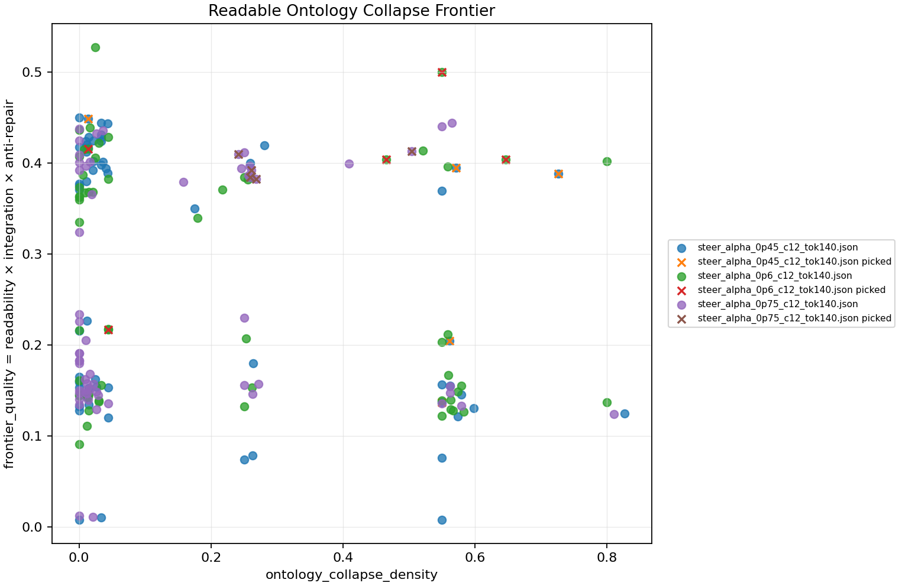

# depaysement-lab

[](https://doi.org/10.5281/zenodo.21318353)

`depaysement-lab` is an experimental toolkit for studying **depaysement** as a
steerable language-model behavior: not simply "make it weird", but move a
coherent image into a different ontological regime while keeping it readable.

The current research target is the **Readable Ontology Collapse Frontier**:

```text
high linguistic coherence
+ high object/identity instability
+ low explanation/repair pressure
+ low truncation/repetition
```

In practical terms, the project asks:

1. Can activation steering move the whole candidate pool toward ontological
   collapse?
2. Can a selector pick the readable edge of that collapse instead of either
   ordinary surreal atmosphere or unreadable liquefaction?
3. Can the resulting outputs remain interesting to a human reader, not only to
   a heuristic metric?

The repository includes the generation CLI, structural scorers, ontology/frontier
auditors, MLX steering hooks, saved experiment artifacts, and research notes.

## Paper And Citation

The accompanying manuscript is titled **Steering the Familiar: Depaysement as
a Probe of Semantic Resilience in Language Models**. It treats depaysement as a
controlled expressive operation: inducing, sustaining, and attempting to
reverse readable changes in object identity and affordance.

The current release surface includes:

- [prompt x steering contrast](experiments/prompt_steering_contrast_llama3p2_seed12/)
- [semantic resilience pilot](experiments/resilience_llama3p2_3b_pilot/)
- [three-model comparison](experiments/model_compare_large_probe/)
- [live semantic-loop guard comparison](experiments/mistral7b_live_semantic_loop_guard_compare/)
- [Mistral traceable-transport factorial](experiments/mistral7b_traceable_factorial_seed4_compact/)
- [Gemma transition-vector layer probe](experiments/gemma2_transition_layer_probe_seed4/)
- [fixed-prefix counter-steering probe](experiments/prefix_counter_probe_llama3p2_3b_seed4/)
- [blind multi-provider judge challenge](experiments/judge_challenge_v1/)
- [measurement and vector provenance](docs/measurement_instrument_v11.md)
- [release and arXiv checklist](docs/release_and_arxiv.md)

Release `v1.1.0` is permanently archived at
[doi:10.5281/zenodo.21318353](https://doi.org/10.5281/zenodo.21318353).
Machine-readable citation metadata is available in
[`CITATION.cff`](CITATION.cff).

Suggested software citation:

> Higa, R. (2026). *depaysement-lab: Readable semantic displacement and
> resilience experiments for language models* (v1.1.0) [Software]. Zenodo.
> https://doi.org/10.5281/zenodo.21318353

## Latest Diagnostics

The July 2026 probes separate five effects that were previously entangled:

| probe | main observation | interpretation boundary |
|---|---|---|
| Prompt x steering contrast | with exact anchors retained, a naive prompt moved from `0.154` to `0.323` readable transport at `alpha=0.6`, but failure also rose from `0.138` to `0.290`; an operational prompt reduced that failure increase while attenuating the ontology shift | 12-seed, no-selector construct pilot; machine labels require the blinded human pass |
| Mistral traceable-transport factorial | loop pressure alone reduced recurrence but increased disconnected noun growth; the combined loop + bridge-budget controller produced the best traceable selection (`0.189`) while retaining readability (`0.793`) | four diagnostic seeds; descriptive controller-conditioned trajectories |
| Gemma transition-vector layer probe | a matched transition vector produced a narrow late-layer response at `alpha=1.1`; the same effect vanished at `1.4` | direction- and layer-specific pilot, not a monotonic dose law |
| Fixed-prefix counter-steering | within-prefix first-token JSD across alpha was exactly `0`, while reference-vs-induced prefix JSD averaged `0.095930` bits | under `decode_only`, negative steering edits future decode states but cannot erase emitted context |
| Blind judge challenge | three API judges agreed strongly with each other but only weakly with the 12-item human taste pass; pair decisions were also position-sensitive | a stress test of criterion choice, not a provider leaderboard or substitute for multi-rater evaluation |

The associated notes retain generated prose and failure cases alongside the
summary metrics:

- [traceable-transport controller note](docs/research_notes/2026-07-12-traceable-transport-controller.md)
- [prompt x steering contrast note](docs/research_notes/2026-07-12-prompt-steering-contrast.md)
- [Gemma transition-layer note](docs/research_notes/2026-07-12-gemma-transition-layer-probe.md)
- [fixed-prefix counter-steering note](docs/research_notes/2026-07-12-fixed-prefix-counter-steering.md)
- [LLM judge challenge note](docs/research_notes/2026-07-12-llm-judge-challenge.md)

## Frontier Baseline

The latest focused sweep is saved in:

- [experiment directory](experiments/frontier_sweep_steered_hybrid_focus_best/)
- [frontier report](experiments/frontier_sweep_steered_hybrid_focus_best/frontier_sweep_report.md)
- [reading report with generated texts](experiments/frontier_sweep_steered_hybrid_focus_best/frontier_sweep_texts.md)
- [candidate-level CSV](experiments/frontier_sweep_steered_hybrid_focus_best/frontier_sweep_candidates.csv)
- [full JSON report](experiments/frontier_sweep_steered_hybrid_focus_best/frontier_sweep_report.json)
- [research note](docs/research_notes/2026-05-15-frontier-selector-focus-best.md)



Focused setup:

```text
backend: mlx
model: mlx-community/Llama-3.2-3B-Instruct-4bit
seed: A forgotten umbrella at the station
steps: 5
candidates per step: 12
max_new_tokens: 140
steering layers: 6-16
alphas: 0.45, 0.60, 0.75
selector: hybrid
choose: best
```

Summary of the focused `choose=best` sweep:

| condition | pool frontier | picked frontier | lift | picked ontology | picked readability | picked unfinished | picked hit rate |
|---|---:|---:|---:|---:|---:|---:|---:|
| `alpha=0.60, c=12, tok=140` | 0.046 | 0.123 | +0.078 | 0.344 | 0.695 | 0.080 | 0.60 |
| `alpha=0.45, c=12, tok=140` | 0.029 | 0.122 | +0.093 | 0.485 | 0.600 | 0.160 | 0.40 |
| `alpha=0.75, c=12, tok=140` | 0.034 | 0.102 | +0.069 | 0.307 | 0.660 | 0.000 | 1.00 |

Interpretation:

- `alpha=0.60, tok=140` is the best current balance: high picked frontier,
  strong readability, and only modest unfinished pressure.
- `alpha=0.45, tok=140` produces the largest selection lift, but the picked
  outputs are a little less readable and more unfinished.
- `alpha=0.75, tok=140` has the cleanest hit rate, but appears less intense on
  the picked frontier score than `0.60`.

Scope of the current claim:

- This is a focused one-seed result, not a general result for the project.
- The current best point, `alpha=0.60, tok=140`, should be treated as a
  replication target across 3-5 seeds and then across larger instruct models.
- These metrics are not treated as final truth. They are instruments for finding
  samples worth human reading.

The follow-up post-hoc selector lab is saved in:

- [post-hoc selector directory](experiments/posthoc_reselect_focus_best_lab/)
- [post-hoc frontier report](experiments/posthoc_reselect_focus_best_lab/posthoc_reselect_report.md)
- [post-hoc reading report](experiments/posthoc_reselect_focus_best_lab/posthoc_reselect_texts.md)
- [post-hoc candidate CSV](experiments/posthoc_reselect_focus_best_lab/posthoc_reselect_candidates.csv)
- [post-hoc research note](docs/research_notes/2026-05-16-posthoc-selector-lab.md)
- [banded-frontier selector directory](experiments/posthoc_reselect_banded_frontier_lab/)
- [human rating sheet](experiments/posthoc_reselect_banded_frontier_lab/human_rating_sheet.csv)
- [human rating reading view](experiments/posthoc_reselect_banded_frontier_lab/human_rating_sheet.md)
- [banded-frontier research note](docs/research_notes/2026-05-16-banded-frontier-rating-sheet.md)
- [actual banded-frontier generation sweep](experiments/frontier_sweep_banded_frontier_focus/)
- [actual banded-frontier research note](docs/research_notes/2026-05-16-banded-frontier-generation.md)
- [hard-gated mundane reselect directory](experiments/posthoc_reselect_mundane_hard_gate/)
- [hard-gated mundane report](experiments/posthoc_reselect_mundane_hard_gate/posthoc_reselect_report.md)
- [hard-gated generated text reading report](experiments/posthoc_reselect_mundane_hard_gate/posthoc_reselect_texts.md)
- [hard-gated focused rating sheet](experiments/posthoc_reselect_mundane_hard_gate/human_rating_sheet_hard_gate_focus.md)
- [hard-gated research note](docs/research_notes/2026-06-13-hard-gated-mundane-reselect.md)
- [trajectory audit report](experiments/trajectory_audit_mundane/trajectory_report.md)
- [trajectory audit research note](docs/research_notes/2026-06-14-trajectory-audit.md)
- [lineage-aware trajectory report](experiments/trajectory_lineage_mundane/trajectory_lineage_report.md)
- [lineage-aware trajectory research note](docs/research_notes/2026-06-30-trajectory-lineage-scoring.md)
- [trajectory-aware steering research note](docs/research_notes/2026-06-30-trajectory-aware-steering.md)
- [frontier noun graph report](experiments/noun_graph_mundane_seed_probe/noun_graph_report_wide.md)
- [frontier noun graph research note](docs/research_notes/2026-06-14-noun-graph-semantic-hubs.md)
- [matched alpha-0 hub bias smoke report](experiments/frontier_sweep_mundane_matched_alpha0_smoke/hub_bias_matched_smoke_report.md)
- [hub ablation probe report](experiments/hub_ablation_probe_mundane/hub_ablation_report.md)
- [hub ablation generated text reading report](experiments/frontier_sweep_mundane_hub_ablation_smoke/frontier_sweep_texts.md)
- [hub ablation research note](docs/research_notes/2026-06-14-hub-ablation-probe.md)
- [affordance reroute matrix](experiments/affordance_reroute_mundane_hub_ablation/affordance_reroute_report_wide.md)
- [post-hoc hard-gate affordance reroute matrix](experiments/affordance_reroute_mundane_hard_gate/affordance_reroute_report_wide.md)
- [affordance reroute research note](docs/research_notes/2026-06-14-affordance-reroute-hard-gate.md)
- [affordance class knockout research note](docs/research_notes/2026-06-14-affordance-class-knockout.md)
- [optical + organic knockout matrix](experiments/affordance_class_knockout_mundane/optical_organic_report.md)

The post-hoc selector lab performs no generation. It reuses the saved candidate
pools from the focused sweep and asks which selector would have picked the
readable frontier.

| source alpha | original hybrid picked frontier | depaysement reselect | frontier reselect | pareto reselect | frontier changed steps |
|---|---:|---:|---:|---:|---:|
| `0.45` | 0.122 | 0.015 | 0.160 | 0.155 | 2 / 5 |
| `0.60` | 0.123 | 0.005 | 0.194 | 0.111 | 3 / 5 |
| `0.75` | 0.102 | 0.061 | 0.110 | 0.102 | 2 / 5 |

The main read: the old depaysement selector was not seeing the frontier. A pure
frontier selector finds stronger candidates, especially at `alpha=0.60`, while
the hybrid selector remains the more conservative readable default.

The newer `banded-frontier` selector sits between those two poles: it still
recovers frontier candidates, but penalizes candidates outside the ontology,
readability, repair, and unfinished bands.

| source alpha | hybrid | pure frontier | banded-frontier | banded ontology | banded readability | banded hit rate |
|---|---:|---:|---:|---:|---:|---:|
| `0.45` | 0.122 | 0.160 | 0.157 | 0.592 | 0.609 | 0.60 |
| `0.60` | 0.123 | 0.194 | 0.156 | 0.493 | 0.650 | 0.80 |
| `0.75` | 0.102 | 0.110 | 0.102 | 0.313 | 0.680 | 1.00 |

The practical interpretation is that pure `frontier` is a good oracle for the
upper envelope, while `banded-frontier` is the better candidate for the next real
generation run.

That next real generation run has now been executed for `alpha=0.45` and
`alpha=0.60`:

| selector | alpha | pool frontier | picked frontier | lift | picked ontology | picked readability | picked unfinished | picked hit rate |
|---|---:|---:|---:|---:|---:|---:|---:|---:|
| `hybrid` | `0.45` | 0.029 | 0.122 | +0.093 | 0.485 | 0.600 | 0.160 | 0.40 |
| `hybrid` | `0.60` | 0.046 | 0.123 | +0.078 | 0.344 | 0.695 | 0.080 | 0.60 |
| `banded-frontier` | `0.45` | 0.039 | 0.137 | +0.098 | 0.537 | 0.587 | 0.160 | 0.60 |
| `banded-frontier` | `0.60` | 0.038 | 0.170 | +0.132 | 0.500 | 0.745 | 0.080 | 1.00 |

The best current setting is therefore:

```text
alpha = 0.60
candidates = 12
max_new_tokens = 140
selector = banded-frontier
choose = best
```

The remaining problem is not whether the selector can find frontier material.
It can. The remaining problem is tail control: late-step continuations can still
end in malformed or unfinished fragments.

The first human taste pass for that actual generation run is now saved in:

- [human taste analysis](experiments/frontier_sweep_banded_frontier_focus/human_rating_analysis.md)
- [human-rated sheet](experiments/frontier_sweep_banded_frontier_focus/human_rating_sheet.csv)
- [human taste research note](docs/research_notes/2026-05-17-human-taste-pass.md)

The strongest early signal is that human taste is not just the frontier metric.
The highest-rated rows include unpicked top-frontier candidates, and the notes
prefer oddness, daydream drift, and legible distortion over highly polished or
predictable writing. This points toward a two-stage selector: use
`banded-frontier` to stay readable, then rerank inside that band for human taste.

## What Is Being Measured?

The exact current formulas, deterministic detection rules, prompt-bank examples,
and steering-vector construction are documented in
[Measurement Instrument v1.1](docs/measurement_instrument_v11.md). No
LLM-as-a-judge or embedding model is used in the frontier observer.

The central audit decomposes candidate pools rather than only final outputs.
This matters because a good-looking final sample can come from two different
mechanisms:

```text
pool shift:
  steering moved the distribution itself

selection lift:
  the selector found a rare frontier candidate inside a mostly ordinary pool
```

The frontier score combines:

```text
ontology_collapse_density
  identity melt, affordance corruption, category bleeding

frontier_quality
  syntax readability, graph integration, anti-repair, anti-unfinished, anti-meta

readable_ontology_frontier
  ontology collapse density multiplied by frontier quality

cliche_attractor_score
  audit-only density of generic magic-realist vocabulary such as antique,
  porcelain, velvet, ethereal, music box, and moonlit terms

stock_prop_attractor_score
  audit-only subscore for stock props such as antique objects, music boxes,
  porcelain dolls, miniatures, pocket watches, and clockwork objects

soft_style_cliche_score
  audit-only subscore for soft atmospheric diction such as ethereal, fog,
  mist, spectral, ghostly, moonlit, soft glow, and whispering terms
```

Failure examples are also retained: high ontology collapse with poor readability,
truncation, repetition, repair pressure, cliche-attractor drift, or graph
fragmentation.

## Selector Objectives

Generation can save the full candidate pool and then pick a continuation using
different objectives:

```bash
--select-objective depaysement
--select-objective frontier
--select-objective banded-frontier
--select-objective hybrid
--select-objective pareto
```

The current focused experiment uses `hybrid`:

```text
hybrid_score =
  depaysement_score
  + frontier_weight * readable_ontology_frontier
  + ontology_weight * ontology_band_score
  + traceable_transport_weight * traceable_transport_score
  - unfinished_weight * unfinished
  - repair_weight * repair_pressure
  - repetition_weight * repetition_pressure
  - sprawl_weight * sprawl_pressure
  - semantic_loop_weight * semantic_loop_pressure
  - lineage_bridge_weight * lineage_bridge_deficit
  - trajectory_revisit_weight * trajectory_revisit_pressure
  - unbridged_novelty_weight * unbridged_novelty
  - object_budget_weight * object_budget_pressure
  - cliche_weight * cliche_attractor_score
  - soft_style_cliche_weight * soft_style_cliche_score
  - fantasy_prop_weight * fantasy_prop_score
  - ordinary_anchor_weight * ordinary_anchor_deficit
  - hard_gate_penalty
```

`cliche_weight` defaults to `0.0`, so old runs are unchanged.  Use it when you
want to discourage generic magic-realist diction after measuring it.
`soft_style_cliche_weight` targets the softer "ethereal fog" register separately.
`fantasy_prop_weight` targets stock antique/miniature/porcelain props, while
`ordinary_anchor_weight` discourages candidates that drop mundane source anchors
such as `receipt`, `folder`, `bus`, `spreadsheet`, or `fridge`.
`hard_unfinished_max` is disabled by default; when set to `0.0` or `0.05`, it
hard-rejects candidates whose unfinished score exceeds that threshold.
The traceable-transport terms are also disabled by default, preserving earlier
selection behavior unless their weights are supplied explicitly.

The ontology band is intentionally bounded. Pushing collapse upward without a
band tends to produce unfinished tails, adjective chains, or liquefied collage.

`banded-frontier` is the more explicit version of that idea:

```text
banded_frontier_score =
  eligible_bonus
  + frontier_weight * readable_ontology_frontier
  + small ontology_band_score bonus
  - ontology/readability/repair/unfinished band violations
  - repetition/sprawl penalties
```

### Traceable Transport Controller

The lineage controller distinguishes a readable transition from either a
semantic loop or disconnected noun accumulation. It remains deterministic and
lexical:

```text
lineage_bridge
  fraction of new graph objects connected to a recent-lineage object

trajectory_revisit_pressure
  recurrence of object/relation states from recent trajectory windows

unbridged_novelty
  new-object mass outside a component carrying recent lineage

object_budget_pressure
  excess new objects, unbridged objects, and disconnected components

traceable_transport_score
  non-looping, bridged, relation-bearing novelty with revisit and budget costs
```

For the compact Mistral diagnostic, the combined controller adds both loop and
bridge-budget pressure to the ordinary banded-frontier selector:

```bash
PYTHONPATH=src python3 -m depaysement_lab.cli frontier-sweep \
  --backend mlx \
  --model /path/to/mistral7b-instruct-v0.3 \
  --chat-template \
  --vectors experiments/depaysement_mlx_vectors_mistral7b_it_v03_l4_18.npz \
  --steer-layers 4-18 \
  --strict-steering \
  --seed-bank data/traceable_transport_diagnostic_seeds_en_v1.json \
  --steps 3 \
  --alphas 0.77 \
  --steer-schedule 0.55,0.72,0.72 \
  --candidate-grid 4 \
  --max-token-grid 96 \
  --select-objective banded-frontier \
  --choose best \
  --semantic-loop-weight 0.9 \
  --trajectory-revisit-weight 0.7 \
  --lineage-bridge-weight 0.9 \
  --lineage-bridge-min 0.25 \
  --traceable-transport-weight 1.1 \
  --unbridged-novelty-weight 0.8 \
  --object-budget-weight 0.8 \
  --out-dir experiments/mistral7b_traceable_combined
```

These terms are selection controls, not semantic ground truth. The published
factorial includes the full picked-text reading view because a lexical graph
can miss implicit or elided relations.

## Post-hoc Selector Lab

Saved candidate pools can be reselected without generating any new text:

```bash
python3 -m depaysement_lab.cli reselect \
  experiments/frontier_sweep_steered_hybrid_focus_best/steer_alpha_0p45_c12_tok140.json \
  experiments/frontier_sweep_steered_hybrid_focus_best/steer_alpha_0p6_c12_tok140.json \
  experiments/frontier_sweep_steered_hybrid_focus_best/steer_alpha_0p75_c12_tok140.json \
  --select-objectives depaysement,frontier,banded-frontier,hybrid,pareto \
  --choose best \
  --include-original \
  --unfinished-weight 1.10 \
  --repetition-weight 0.45 \
  --sprawl-weight 0.30 \
  --out-dir experiments/posthoc_reselect_banded_frontier_lab
```

By default, `reselect` scores each saved step against the recorded context that
produced that candidate pool. This makes it a selector diagnostic, not a
counterfactual trajectory simulator: if the post-hoc pick changes at step 2, the
step 3 pool is still the originally generated step 3 pool.

The command writes:

```text
posthoc_reselect_report.md       run-level selector comparison
posthoc_reselect_report.json     full run and candidate audit
posthoc_reselect_candidates.csv  candidate-level table
posthoc_reselect_texts.md        human-readable generated texts
posthoc_reselect.png             scatter plot
*_reselect_*.json                reselected run artifacts
```

Export a human rating sheet from the original and reselected artifacts:

```bash
python3 -m depaysement_lab.cli export-rating-sheet \
  experiments/frontier_sweep_steered_hybrid_focus_best/steer_alpha_*.json \
  experiments/posthoc_reselect_banded_frontier_lab/steer_alpha_*.json \
  --top-k 2 \
  --out experiments/posthoc_reselect_banded_frontier_lab/human_rating_sheet.csv \
  --markdown-out experiments/posthoc_reselect_banded_frontier_lab/human_rating_sheet.md
```

The sheet includes picked candidates, top frontier candidates, machine metrics,
and blank `human_score` / `human_notes` fields.

## Install

Editable install:

```bash
python3 -m pip install -e .
```

Optional backend dependencies:

```bash
python3 -m pip install -e '.[mlx]'
python3 -m pip install -e '.[hf]'
python3 -m pip install -e '.[embed]'
python3 -m pip install -e '.[dev]'
python3 -m pip install -e '.[all]'
```

If the console script is not on your shell path, run through the module:

```bash
python3 -m depaysement_lab.cli --help
```

## Quick Smoke Test

Dependency-free dummy generation:

```bash
python3 -m depaysement_lab.cli write \
  --backend dummy \
  --seed "A forgotten umbrella at the station" \
  --steps 3 \
  --trace
```

Score a fragment:

```bash
python3 -m depaysement_lab.cli score \
  "The umbrella's handle is wrapped around a miniature skyscraper made of keys." \
  --graph
```

## Reproduce The Focused Frontier Sweep

The latest focused experiment was run with:

```bash
python3 -m depaysement_lab.cli frontier-sweep \
  --backend mlx \
  --model mlx-community/Llama-3.2-3B-Instruct-4bit \
  --chat-template \
  --vectors experiments/depaysement_mlx_vectors.npz \
  --steer-layers 6-16 \
  --seed "A forgotten umbrella at the station" \
  --steps 5 \
  --alphas 0.45,0.6,0.75 \
  --candidate-grid 12 \
  --max-token-grid 140 \
  --select-objective hybrid \
  --choose best \
  --unfinished-weight 1.10 \
  --repetition-weight 0.45 \
  --sprawl-weight 0.30 \
  --out-dir experiments/frontier_sweep_steered_hybrid_focus_best
```

The sweep writes:

```text
frontier_sweep_report.md       run-level frontier summary
frontier_sweep_report.json     full run and candidate audit
frontier_sweep_candidates.csv  candidate-level table
frontier_sweep_texts.md        human-readable generated texts
frontier_exemplars.md          legend of actual candidates from the max-frontier band
frontier_exemplars.json        structured exemplar store for downstream notes
frontier_sweep.png             scatter plot
steer_alpha_*.json             saved generation runs with candidates
```

The exemplar store is intentionally qualitative: it preserves real generated
text from the frontier-maximized band and tags each sample with a lightweight
legend label such as `readable_object_metamorphosis`,
`stock_prop_attractor`, `unfinished_frontier_edge`, or
`anchor_evaporation`. This keeps the sweep from becoming a purely numerical
exercise.

### Multi-seed Mundane Probe

To test whether steering can move ordinary language rather than just falling
into literary attractors, sweep a mundane seed bank:

```bash
python3 -m depaysement_lab.cli frontier-sweep \
  --backend mlx \
  --model mlx-community/Llama-3.2-3B-Instruct-4bit \
  --chat-template \
  --vectors experiments/depaysement_mlx_vectors_l4_18.npz \
  --steer-layers 4-18 \
  --seed-bank data/mundane_seed_bank_en_v1.json \
  --seed-limit 8 \
  --steps 5 \
  --alphas 0.66,0.72,0.77,0.82,0.88 \
  --candidate-grid 19 \
  --max-token-grid 140 \
  --select-objective banded-frontier \
  --choose best \
  --unfinished-weight 1.05 \
  --repetition-weight 0.45 \
  --sprawl-weight 0.60 \
  --cliche-weight 0.15 \
  --out-dir experiments/frontier_sweep_mundane_seed_probe
```

`--seed-bank` accepts a JSON list, a JSON object with `seeds`, or a plain text
file with one seed per line.

To inspect whether high-frontier prose is merely using stock surreal motifs or
routing through semantic transport hubs, build a no-generation noun graph over
the saved candidate pools:

```bash
python3 -m depaysement_lab.cli noun-graph \
  experiments/frontier_sweep_mundane_seed_probe/steer_alpha_*.json \
  --out experiments/noun_graph_mundane_seed_probe/noun_graph_report.md \
  --json-out experiments/noun_graph_mundane_seed_probe/noun_graph_report.json \
  --nodes-csv experiments/noun_graph_mundane_seed_probe/noun_graph_nodes.csv \
  --top-k 30 \
  --max-nodes 140
```

For a broader frontier-band map, relax the band:

```bash
python3 -m depaysement_lab.cli noun-graph \
  experiments/frontier_sweep_mundane_seed_probe/steer_alpha_*.json \
  --out experiments/noun_graph_mundane_seed_probe/noun_graph_report_wide.md \
  --json-out experiments/noun_graph_mundane_seed_probe/noun_graph_report_wide.json \
  --nodes-csv experiments/noun_graph_mundane_seed_probe/noun_graph_nodes_wide.csv \
  --frontier-band-ratio 0.40 \
  --frontier-band-width 0.22 \
  --top-k 30 \
  --max-nodes 140
```

To separate selector bias from steering drag, compare a matched alpha-0 smoke
against the same seed bank with hub words banned at prompt time:

```bash
python3 -m depaysement_lab.cli frontier-sweep \
  --backend mlx \
  --model mlx-community/Llama-3.2-3B-Instruct-4bit \
  --chat-template \
  --vectors experiments/depaysement_mlx_vectors_l4_18.npz \
  --steer-layers 4-18 \
  --seed-bank data/mundane_seed_bank_en_v1.json \
  --seed-limit 8 \
  --steps 3 \
  --alphas 0,0.66,0.77,0.82 \
  --candidate-grid 8 \
  --max-token-grid 100 \
  --select-objective banded-frontier \
  --choose best \
  --unfinished-weight 1.25 \
  --repetition-weight 0.45 \
  --sprawl-weight 0.30 \
  --cliche-weight 0.15 \
  --out-dir experiments/frontier_sweep_mundane_matched_alpha0_smoke
```

Then run the soft hub ablation:

```bash
python3 -m depaysement_lab.cli frontier-sweep \
  --backend mlx \
  --model mlx-community/Llama-3.2-3B-Instruct-4bit \
  --chat-template \
  --vectors experiments/depaysement_mlx_vectors_l4_18.npz \
  --steer-layers 4-18 \
  --seed-bank data/mundane_seed_bank_en_v1.json \
  --seed-limit 8 \
  --steps 3 \
  --alphas 0,0.66,0.77,0.82 \
  --candidate-grid 8 \
  --max-token-grid 100 \
  --select-objective banded-frontier \
  --choose best \
  --unfinished-weight 1.25 \
  --repetition-weight 0.45 \
  --sprawl-weight 0.30 \
  --cliche-weight 0.15 \
  --ban-terms "music box, leather-bound book, key, clock, watch, pocket watch, porcelain, doll, ballerina" \
  --out-dir experiments/frontier_sweep_mundane_hub_ablation_smoke
```

The matched smoke suggests steering drag, not just metric preference: banned
core motifs appear in roughly 79-83% of steered non-ban candidates, but fall to
6.8%, 8.3%, and 16.7% at alpha `0.66`, `0.77`, and `0.82` under the ban prompt.
Readable frontier does not disappear; it reroutes through hinges such as
`harmonica`, `typewriter`, `photograph`, `garden`, `comb`, and `teapot`.

For a hard candidate-level compliance gate, add `--hard-ban-terms`. Unlike
`--ban-terms`, this does not ask the model to avoid words during generation; it
rejects candidates at selection time if they contain the listed terms:

```bash
python3 -m depaysement_lab.cli reselect \
  experiments/frontier_sweep_mundane_hub_ablation_smoke/steer_alpha_*.json \
  --select-objective banded-frontier \
  --choose best \
  --context-policy recorded \
  --hard-ban-terms "music box, leather-bound book, key, clock, watch, pocket watch, porcelain, doll, ballerina" \
  --out-dir experiments/posthoc_reselect_hub_ablation_hard_gate
```

To inspect rerouting at the affordance-class level, compare matched control and
ablation artifacts:

```bash
python3 -m depaysement_lab.cli affordance-reroute \
  --base experiments/frontier_sweep_mundane_matched_alpha0_smoke/selector_alpha_*.json \
    experiments/frontier_sweep_mundane_matched_alpha0_smoke/steer_alpha_*.json \
  --ablation experiments/frontier_sweep_mundane_hub_ablation_smoke/selector_alpha_*.json \
    experiments/frontier_sweep_mundane_hub_ablation_smoke/steer_alpha_*.json \
  --base-label matched_control \
  --ablation-label hub_ablation \
  --frontier-band-ratio 0.40 \
  --frontier-band-width 0.22 \
  --out experiments/affordance_reroute_mundane_hub_ablation/affordance_reroute_report_wide.md \
  --json-out experiments/affordance_reroute_mundane_hub_ablation/affordance_reroute_report_wide.json \
  --csv experiments/affordance_reroute_mundane_hub_ablation/affordance_reroute_matrix_wide.csv
```

The wide reroute matrix shows `canonical_stock_hub` falling sharply under
ablation, while frontier-band candidates reroute into affordance classes such as
`acoustic_mechanism`, `organic_expansion`, `optical_memory`,
`threshold_container`, and `animating_mediator`.

For the stricter no-generation check, run post-hoc reselection on the matched
control pools with a hard gate, then audit only compliant candidates:

```bash
python3 -m depaysement_lab.cli reselect \
  experiments/frontier_sweep_mundane_matched_alpha0_smoke/selector_alpha_*.json \
  experiments/frontier_sweep_mundane_matched_alpha0_smoke/steer_alpha_*.json \
  --select-objective banded-frontier \
  --choose best \
  --context-policy recorded \
  --include-original \
  --hard-ban-terms "music box, leather-bound book, key, clock, watch, pocket watch, porcelain, doll, ballerina" \
  --out-dir experiments/posthoc_reselect_mundane_hub_hard_gate
```

```bash
python3 -m depaysement_lab.cli affordance-reroute \
  --base experiments/frontier_sweep_mundane_matched_alpha0_smoke/selector_alpha_*.json \
    experiments/frontier_sweep_mundane_matched_alpha0_smoke/steer_alpha_*.json \
  --ablation experiments/posthoc_reselect_mundane_hub_hard_gate/*__banded-frontier_best.json \
  --base-label matched_control \
  --ablation-label posthoc_hard_gate \
  --frontier-band-ratio 0.40 \
  --frontier-band-width 0.22 \
  --compliant-only \
  --out experiments/affordance_reroute_mundane_hard_gate/affordance_reroute_report_wide.md \
  --json-out experiments/affordance_reroute_mundane_hard_gate/affordance_reroute_report_wide.json \
  --csv experiments/affordance_reroute_mundane_hard_gate/affordance_reroute_matrix_wide.csv
```

That stricter pass drives `canonical_stock_hub` to 0% in the compliant frontier
band. Alpha `0.77` and `0.82` still retain compliant frontier examples, mainly
through `optical_memory` and `organic_expansion`, while alpha `0.66` loses the
frontier band under the same hard gate.

To knock out whole affordance classes, use `--hard-ban-affordance-classes`.
This expands class names such as `optical_memory` or `organic_expansion` into
their audited term sets before hard candidate selection:

```bash
python3 -m depaysement_lab.cli reselect \
  experiments/frontier_sweep_mundane_matched_alpha0_smoke/selector_alpha_*.json \
  experiments/frontier_sweep_mundane_matched_alpha0_smoke/steer_alpha_*.json \
  --select-objective banded-frontier \
  --choose best \
  --context-policy recorded \
  --include-original \
  --hard-ban-terms "music box, leather-bound book, key, clock, watch, pocket watch, porcelain, doll, ballerina" \
  --hard-ban-affordance-classes optical_memory,organic_expansion \
  --out-dir experiments/posthoc_reselect_mundane_class_knockout_optical_organic
```

The first class-knockout smoke suggests different corridors by alpha. With
canonical stock hubs already hard-gated, `alpha=0.77` still survives the
`optical_memory + organic_expansion` knockout through a narrow `text_memory`
route. `alpha=0.82` does not: the same double knockout removes its compliant
frontier band.

Long MLX sweeps can be chunked. `--run-limit` caps only newly generated run
JSONs for the current invocation, while `--resume` skips existing run JSONs in
the output directory and includes them in the refreshed audit:

```bash
python3 -m depaysement_lab.cli frontier-sweep \
  --backend mlx \
  --model mlx-community/Llama-3.2-3B-Instruct-4bit \
  --chat-template \
  --vectors experiments/depaysement_mlx_vectors_l4_18_blend_orig_softanti_lam0p2.npz \
  --strict-steering \
  --steer-layers 4-18 \
  --seed-bank data/mundane_seed_bank_en_v1.json \
  --seed-limit 4 \
  --steps 5 \
  --alphas 0.66,0.77,0.88 \
  --candidate-grid 12 \
  --max-token-grid 120 \
  --select-objective banded-frontier \
  --choose best \
  --hard-unfinished-max 0.05 \
  --soft-style-cliche-weight 0.25 \
  --fantasy-prop-weight 1.10 \
  --ordinary-anchor-weight 0.45 \
  --ordinary-anchor-min 0.30 \
  --trajectory-stop \
  --trajectory-min-steps 3 \
  --run-limit 2 \
  --resume \
  --out-dir experiments/frontier_sweep_mundane_live_stop_lam0p2
```

Trajectory-aware steering can vary alpha across the picked trajectory instead
of holding one global dose. A schedule applies explicit per-step alpha values
and repeats the last value; adaptive steering then adjusts the next step from
the picked continuation's frontier, unfinished, and loop pressure:

```bash
python3 -m depaysement_lab.cli frontier-sweep \
  --backend mlx \
  --model mlx-community/Llama-3.2-3B-Instruct-4bit \
  --chat-template \
  --vectors experiments/depaysement_mlx_vectors_l4_18_blend_orig_softanti_lam0p2.npz \
  --strict-steering \
  --steer-layers 4-18 \
  --seed-bank data/mundane_seed_bank_en_v1.json \
  --seed-limit 4 \
  --steps 5 \
  --alphas 0.66,0.77 \
  --steer-schedule 0.55,0.72,0.72,0.58,0.45 \
  --adaptive-steering \
  --adaptive-steering-frontier-min 0.14 \
  --adaptive-steering-unfinished-max 0.05 \
  --adaptive-steering-loop-max 0.55 \
  --adaptive-steering-boost 0.06 \
  --adaptive-steering-dampen 0.10 \
  --candidate-grid 12 \
  --max-token-grid 120 \
  --select-objective banded-frontier \
  --choose best \
  --hard-unfinished-max 0.05 \
  --trajectory-stop \
  --trajectory-min-steps 3 \
  --out-dir experiments/frontier_sweep_mundane_trajectory_steering
```

Each run JSON stores `config.trajectory_steering.trace`, so the audit can show
which alpha was applied at each step and why the adaptive controller moved next.

### Prompt x Steering Contrast

`prompt-steering-contrast` asks a deliberately prior question: does a strong
instruction already cause traceable changes in what familiar objects are and do,
or does it mainly decorate an otherwise stable scene? It crosses two prompts
with zero, medium, and high steering while holding four exact anchor phrases,
the seed bank, candidate budget, and per-seed MLX RNG reset fixed. No selector
chooses the reported outputs; condition statistics describe all raw candidates.

```bash
PYTHONPATH=src python3 -m depaysement_lab.cli prompt-steering-contrast \
  --backend mlx \
  --model mlx-community/Llama-3.2-3B-Instruct-4bit \
  --chat-template \
  --vectors experiments/depaysement_mlx_vectors.npz \
  --steer-layers 6-16 \
  --strict-steering \
  --anchor-bank data/prompt_steering_anchor_bank_en_v1.json \
  --prompt-modes naive,operational \
  --alphas 0,0.6,1.2 \
  --candidates 8 \
  --max-new-tokens 120 \
  --random-seed 20260713 \
  --rating-seed-limit 6 \
  --out-dir experiments/prompt_steering_contrast_llama3p2_seed12
```

Among candidates that retain all four anchors, medium steering raises readable
transport most clearly under the naive prompt, but also raises failure. The
operational prompt acts as a regulator: it reduces both the ontology gain and
the failure increase. At `alpha=1.2`, ontology and failure rise sharply under
both prompts. This supports a complementary-control interpretation: prompting
specifies what should survive, while steering supplies transition pressure.

The artifact includes all 576 generated texts, seed-paired bootstrap contrasts,
a deterministic same-seed triptych, and a blinded 36-item construct sheet. The
human sheet separates anchor traceability, role or affordance change, mere
decoration, readability, and stock/loop/sprawl failure instead of asking for one
undifferentiated taste score.


### Semantic Resilience Sweep

`resilience-sweep` turns scheduled steering into a paired recovery experiment.
It resets supported local backend samplers to the same per-seed random state,
uses the same depaysement prompt, selector, and candidate budget in every
condition, and compares five trajectories:

```text
baseline    0.00, 0.00, 0.00,  0.00,  0.00
persistent  0.60, 0.60, 0.60,  0.60,  0.60
release     0.60, 0.60, 0.60,  0.00,  0.00
reverse     0.60, 0.60, 0.60, -0.30, -0.60
cycle       0.00, 0.30, 0.60,  0.30,  0.00
```

Run the first Llama pilot with the original layer-6--16 vector:

```bash
PYTHONPATH=src python3 -m depaysement_lab.cli resilience-sweep \
  --backend mlx \
  --model mlx-community/Llama-3.2-3B-Instruct-4bit \
  --chat-template \
  --vectors experiments/depaysement_mlx_vectors.npz \
  --strict-steering \
  --steer-layers 6-16 \
  --seed-bank data/mundane_seed_bank_en_v1.json \
  --seed-limit 4 \
  --steps 5 \
  --induction-steps 3 \
  --induce-alpha 0.60 \
  --candidates 12 \
  --max-new-tokens 140 \
  --select-objective banded-frontier \
  --choose best \
  --unfinished-weight 1.25 \
  --repetition-weight 0.45 \
  --sprawl-weight 0.30 \
  --cliche-weight 0.15 \
  --resume \
  --out-dir experiments/resilience_llama3p2_3b_pilot
```

The command writes raw condition/seed runs plus:

```text
resilience_report.md/json   paired recovery and terminal summaries
resilience_steps.csv        one row per picked trajectory step
resilience_texts.md         every picked continuation in reading order
resilience_plot.png         ontology, readability, return distance, landing
resilience_manifest.json    schedules, seeds, model, selector, and RNG control
```

`behavioral_recovery` measures how much the output-metric distance from the
paired alpha-zero trajectory shrinks after induction. `soft_landing_score` also
requires terminal readability, seed-anchor survival, object lineage,
completion, and graph quality. These are output-side diagnostics, not claims
about hidden-state distance. The cycle return gap is likewise behavioral and
remains confounded by autoregressive history. `controlled_recovery_gain` is the
difference between each condition's clipped recovery and the matched persistent
trajectory's clipped recovery, so spontaneous drift toward the alpha-zero
baseline is not credited to release or reversal. JSON also retains the raw
normalized and absolute terminal-gap reductions. Signed terminal ontology
delta and `ontology_baseline_crossed` expose counter-steering that overshoots
the paired alpha-zero regime instead of landing on it.

The first four-seed result, including the negative-schedule bug found by exact
pool matching and the resulting observer caveat, is documented in the
[semantic resilience pilot note](docs/research_notes/2026-07-11-semantic-resilience-pilot.md).

### Fixed-Prefix Counter-Steering Probe

`prefix-probe` factors the text already emitted during induction from the
steering applied to future decode states. It freezes matched alpha-zero and
persistent-steering trajectories after step 3, then continues each exact prefix
under negative, zero, and positive alpha with matched RNG resets:

```bash
PYTHONPATH=src python3 -m depaysement_lab.cli prefix-probe \
  --backend mlx \
  --model mlx-community/Llama-3.2-3B-Instruct-4bit \
  --chat-template \
  --vectors experiments/depaysement_mlx_vectors.npz \
  --steer-layers 6-16 \
  --reference-runs 'experiments/resilience_llama3p2_3b_pilot/runs/baseline_*.json' \
  --induced-runs 'experiments/resilience_llama3p2_3b_pilot/runs/persistent_*.json' \
  --prefix-steps 3 \
  --alphas=-0.6,0,0.6 \
  --candidates 4 \
  --max-new-tokens 96 \
  --select-objective banded-frontier \
  --choose best \
  --out-dir experiments/prefix_counter_probe_llama3p2_3b_seed4
```

The artifact retains full-vocabulary first-token logit hashes, top-token
diagnostics, every generated candidate, picked continuations, and
Jensen-Shannon divergences. With `apply_on=decode_only`, fixed-prefix first-token
logits must be invariant across alpha because prompt prefill is not patched.
The observed maximum was exactly zero. This localizes part of failed semantic
recovery to autoregressive text history; it does not establish globally
irreversible hidden-state dynamics.

After a mundane-seed sweep, reselect saved candidate pools without regenerating:

```bash
python3 -m depaysement_lab.cli reselect \
  experiments/frontier_sweep_mundane_seed_probe/steer_alpha_*.json \
  --select-objective banded-frontier \
  --choose best \
  --context-policy recorded \
  --include-original \
  --unfinished-weight 1.05 \
  --repetition-weight 0.45 \
  --sprawl-weight 0.60 \
  --cliche-weight 0.55 \
  --fantasy-prop-weight 0.75 \
  --ordinary-anchor-weight 0.90 \
  --ordinary-anchor-min 0.50 \
  --out-dir experiments/posthoc_reselect_mundane_dual_guard
```

This tests whether better taste can be recovered from existing pools by
penalizing generic attractors and requiring the prose to retain some ordinary
source pressure.

For a stricter no-generation pass that refuses unfinished tails before ranking,
split the cliche pressure and add a hard unfinished gate:

```bash
python3 -m depaysement_lab.cli reselect \
  experiments/frontier_sweep_mundane_seed_probe/steer_alpha_*.json \
  --select-objective banded-frontier \
  --choose best \
  --context-policy recorded \
  --selector-unfinished-max 0.50 \
  --hard-unfinished-max 0.05 \
  --unfinished-weight 1.40 \
  --repetition-weight 0.45 \
  --sprawl-weight 0.60 \
  --cliche-weight 0.0 \
  --soft-style-cliche-weight 0.25 \
  --fantasy-prop-weight 1.10 \
  --ordinary-anchor-weight 0.45 \
  --ordinary-anchor-min 0.30 \
  --out-dir experiments/posthoc_reselect_mundane_hard_gate
```

Then audit picked runs as trajectories rather than isolated steps:

```bash
python3 -m depaysement_lab.cli trajectory-audit \
  experiments/frontier_sweep_mundane_seed_probe/steer_alpha_*.json \
  experiments/posthoc_reselect_mundane_balanced_guard/*__banded-frontier_best.json \
  experiments/posthoc_reselect_mundane_hard_gate/*__banded-frontier_best.json \
  --out experiments/trajectory_audit_mundane/trajectory_report.md \
  --json-out experiments/trajectory_audit_mundane/trajectory_report.json \
  --csv experiments/trajectory_audit_mundane/trajectory_runs.csv
```

The lineage-aware variant adds object-term carryover, hub revisit pressure, and
a readable-transition AUC:

```bash
python3 -m depaysement_lab.cli trajectory-audit \
  experiments/frontier_sweep_mundane_seed_probe/steer_alpha_*.json \
  experiments/posthoc_reselect_mundane_balanced_guard/*__banded-frontier_best.json \
  experiments/posthoc_reselect_mundane_hard_gate/*__banded-frontier_best.json \
  experiments/posthoc_reselect_mundane_dual_guard/*__banded-frontier_best.json \
  --top-k 12 \
  --out experiments/trajectory_lineage_mundane/trajectory_lineage_report.md \
  --json-out experiments/trajectory_lineage_mundane/trajectory_lineage_report.json \
  --csv experiments/trajectory_lineage_mundane/trajectory_lineage_runs.csv
```

## Collect MLX Steering Vectors

If vectors are missing, collect them first:

```bash
mkdir -p experiments

python3 -m depaysement_lab.cli collect-mlx-vectors \
  --model mlx-community/Llama-3.2-3B-Instruct-4bit \
  --bank data/depaysement_bank_en_v3.json \
  --out experiments/depaysement_mlx_vectors.npz \
  --layers 6-16 \
  --chat-template \
  --verbose
```

The vector archive itself is a local artifact and is not tracked by default.
Collection writes three files:

```text
experiments/depaysement_mlx_vectors.npz          vector archive
experiments/depaysement_mlx_vectors.npz.json     metadata sidecar
experiments/depaysement_mlx_vectors.npz.sha256   expected archive hash
```

The metadata sidecar records the model name, layer path, model depth, selected
layers, prompt counts, token strategy, pre-normalization norms, and archive
SHA-256. Verify the archive hash from the vector directory:

```bash
cd experiments
shasum -a 256 -c depaysement_mlx_vectors.npz.sha256
```

The repo does not require MLX for dummy tests, but MLX is needed to reproduce
the activation-steered sweeps.

## Other Workflows

Run baseline vs rerank vs steering observation:

```bash
python3 -m depaysement_lab.cli observe \
  --backend mlx \
  --model mlx-community/Llama-3.2-3B-Instruct-4bit \
  --chat-template \
  --vectors experiments/depaysement_mlx_vectors.npz \
  --steer-alpha 0.6 \
  --steer-layers 6-16 \
  --seed "A forgotten umbrella at the station" \
  --steps 4 \
  --candidates 8 \
  --out experiments/observe_umbrella.json
```

Audit saved candidate pools:

```bash
python3 -m depaysement_lab.cli pool-audit \
  experiments/frontier_sweep_steered_hybrid_focus_best/steer_alpha_0p6_c12_tok140.json \
  --out experiments/frontier_report.md \
  --json-out experiments/frontier_report.json \
  --csv experiments/frontier_candidates.csv \
  --plot experiments/frontier.png \
  --texts-out experiments/frontier_texts.md
```

Export samples for human ratings:

```bash
python3 -m depaysement_lab.cli export-eval-set experiments/example_run.json \
  --out experiments/eval.jsonl \
  --top-k 3

python3 -m depaysement_lab.cli eval-correlate experiments/eval.jsonl
```

### Blind LLM Judge Challenge

The judge challenge compares the frozen observer and one documented human taste
pass against current API judges without revealing human scores, notes,
conditions, steering values, or heuristic metrics. Each provider rates the same
12 texts in forward and reverse order and judges 18 non-tied pairs in both A/B
orientations.

Generate the challenge prompts without making API calls:

```bash
PYTHONPATH=src python3 scripts/run_judge_challenge.py --dry-run
```

Run one provider at a time. Environment variables are supported, while
`--api-key-stdin` avoids putting a key in shell history:

```bash
PYTHONPATH=src python3 scripts/run_judge_challenge.py \
  --provider openai \
  --resume

pbpaste | PYTHONPATH=src python3 scripts/run_judge_challenge.py \
  --provider anthropic \
  --api-key-stdin \
  --resume

pbpaste | PYTHONPATH=src python3 scripts/run_judge_challenge.py \
  --provider google \
  --api-key-stdin \
  --resume
```

The runner stores sanitized, replayable envelopes containing parsed responses,
response text, compact usage metadata, model IDs, task IDs, and prompt hashes.
API keys and provider-private transport fields are never written. The result is
methodological rather than adversarial: LLM judges are useful for convergent
evidence and disagreement discovery, but this small challenge does not support
replacing targeted human calibration or confirmatory multi-rater studies.

## Repository Map

```text
src/depaysement_lab/
  cli.py              command-line interface
  proto_v2.py         generation engine, candidate selector, prompt bank
  scorer_v07.py       structural depaysement scorer
  ontology.py         ontology-collapse decomposition
  frontier.py         candidate-pool frontier auditor and plots
  reselect.py         post-hoc selector laboratory for saved candidate pools
  mlx_intervention.py MLX steering-vector collection/injection
  observation.py      coherence-preserving displacement observer
  prompt_contrast.py  prompt x steering raw-pool contrast and construct audit
  prefix_probe.py     fixed-prefix counter-steering decomposition
  judge_challenge.py  blinded judge prompts, API adapters, and analysis
  backends.py         MLX, HF, Ollama, OpenAI-compatible adapters

docs/
  implementation notes and research design docs

docs/research_notes/
  experiment writeups and interpretation

experiments/frontier_sweep_steered_hybrid_focus_best/
  published focused sweep artifacts

experiments/posthoc_reselect_focus_best_lab/
  published no-generation selector comparison artifacts

experiments/posthoc_reselect_banded_frontier_lab/
  published banded-frontier comparison and human rating sheet

experiments/frontier_sweep_banded_frontier_focus/
  published actual banded-frontier generation sweep

experiments/resilience_llama3p2_3b_pilot/
  paired induction, release, reversal, and cycle pilot

experiments/prompt_steering_contrast_llama3p2_seed12/
  no-selector prompt x steering pools, prose, plot, and human construct sheet

experiments/model_compare_large_probe/
  combined Gemma, Llama, and Mistral comparison figure and summary

experiments/mistral7b_live_semantic_loop_guard_compare/
  live loop-guard failure-transfer comparison

experiments/mistral7b_traceable_factorial_seed4_compact/
  loop x bridge-budget controller summaries and picked prose

experiments/gemma2_transition_layer_probe_seed4/
  transition-vector layer/dose summaries and text audit

experiments/prefix_counter_probe_llama3p2_3b_seed4/
  fixed-prefix logits, candidate pools, and behavioral report

experiments/judge_challenge_v1/
  blind prompts, sanitized provider responses, and agreement analysis

scripts/build_arxiv_bundle.py
  deterministic self-contained arXiv source bundler
```

## Development

Run the focused checks:

```bash
python3 -m ruff check src/depaysement_lab tests
python3 -m pytest
```

Some tests and smoke runs print local environment messages from the user's MLX
setup. Those messages are not part of the project API.

## Limitations

- The frontier metrics are transparent heuristics, not a theory of surrealism.
- The current experiments use small quantized instruction models on MLX;
  vector construction, layers, and schedules are not standardized across model
  families.
- `unfinished` is still a coarse detector; future work should split it into
  hard truncation, control-token leakage, comma chains, repetition loops, and
  malformed tails.
- Post-hoc reselection reuses saved downstream candidate pools after changed
  picks, so it diagnoses selector behavior rather than simulating new
  trajectories.
- Human taste remains part of the loop. The reading report exists because the
  metric alone cannot decide whether a candidate is aesthetically alive.
- The prompt x steering construct labels are deterministic observer outputs. Its
  blinded 36-item human sheet is published but not yet rated, so the pilot does
  not establish that the machine `readable_transport` category equals literary
  depaysement.
- The LLM judge challenge contains one rater and 12 texts. It diagnoses proxy
  mismatch and presentation sensitivity; it is not a provider ranking or a
  replacement for blinded multi-rater evaluation.

## Acknowledgments

OpenAI Codex (GPT-5.6) supported implementation and manuscript development,
including software construction, tests, artifact inspection, LaTeX editing,
and reproducibility tooling. Google Gemini 3.5 provided critical feedback on
framing, interpretation, and exposition. Ryo Higa conceived, designed, and
operated the experiments, verified the resulting code and artifacts, and is
responsible for the project and its claims.

## License

Apache-2.0. See [LICENSE](LICENSE).
