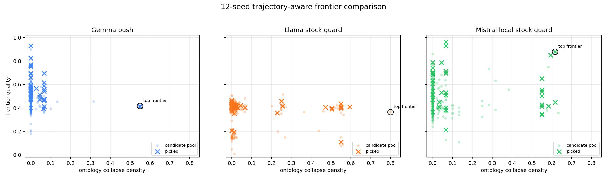
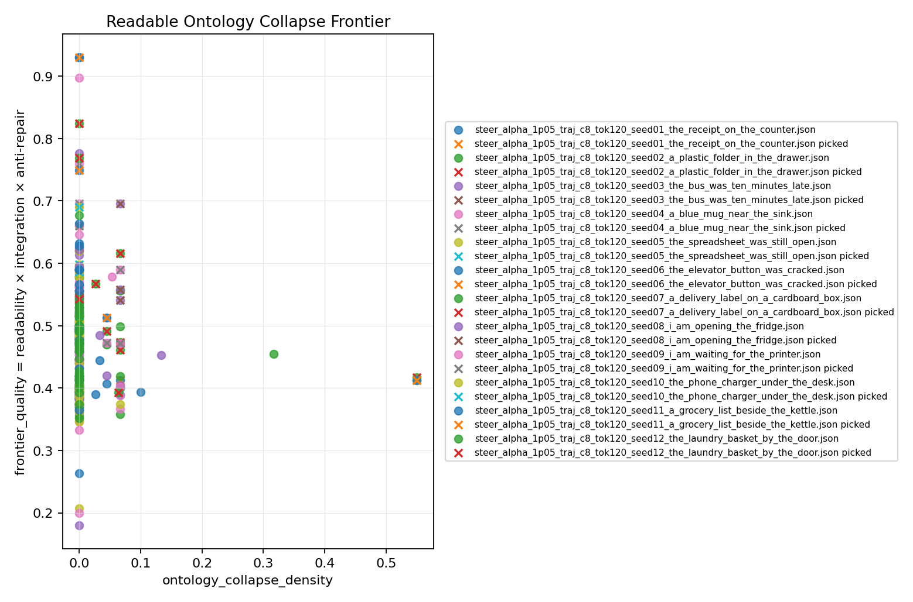
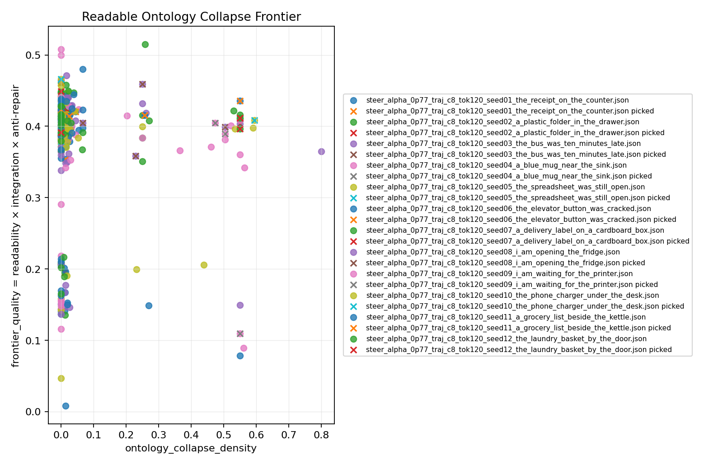
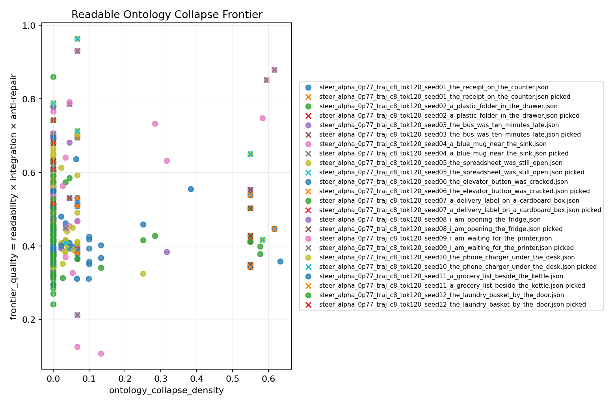

# Larger Model Comparison Probe

This pass reruns the trajectory-aware model comparison with 12 mundane seeds per
model. The goal is to check whether the 4-seed result was a one-off or whether
the same phase difference persists with a denser sample.

The comparison uses the first 12 entries from `data/mundane_seed_bank_en_v1.json`
with `candidate_grid=8`, `max_new_tokens=120`, `select_objective=banded-frontier`,
and trajectory stopping enabled.

## Conditions

| condition | model | alpha / schedule | guard |
|---|---|---|---|
| Gemma push | `mlx-community/gemma-2-2b-it-4bit` | alpha `1.05`, schedule `0.85,1.05,1.15,1.00,0.85` | hard unfinished max `0.05` |
| Llama stock guard | `mlx-community/Llama-3.2-3B-Instruct-4bit` | alpha `0.77`, schedule `0.55,0.72,0.72,0.58,0.45` | hard unfinished max `0.0`, hard-ban `canonical_stock_hub` |
| Mistral local stock guard | `/Users/ryospiralarchitect/SpiralReality/model/mistral7b-instruct-v0.3` | alpha `0.77`, schedule `0.55,0.72,0.72,0.58,0.45` | hard unfinished max `0.0`, hard-ban `canonical_stock_hub` |

Full manifests and generated text reports are stored with the artifacts:

- `experiments/frontier_sweep_model_compare_gemma2_push_traj_seed12/`
- `experiments/frontier_sweep_model_compare_llama_stock_guard_traj_seed12/`
- `experiments/frontier_sweep_model_compare_mistral7b_stock_guard_traj_seed12/`

## Summary

| model condition | runs | pool frontier | picked frontier | pool ontology | read | unfinished | cliche | stock | prop | anchor | picked anchor |
|---|---:|---:|---:|---:|---:|---:|---:|---:|---:|---:|---:|
| Gemma push | 12 | 0.005 | 0.023 | 0.012 | 0.846 | 0.001 | 0.051 | 0.043 | 0.053 | 0.510 | 0.543 |
| Llama stock guard | 12 | 0.022 | 0.057 | 0.072 | 0.659 | 0.042 | 0.451 | 0.331 | 0.390 | 0.732 | 0.810 |
| Mistral local stock guard | 12 | 0.022 | 0.088 | 0.055 | 0.768 | 0.000 | 0.018 | 0.009 | 0.010 | 0.756 | 0.775 |

The larger sample keeps the basic split:

- Gemma remains highly readable and nearly unfinished-free, but most candidates
  stay close to ordinary caption-like continuation.
- Llama still carries more stock and cliche pressure in the pool, but the picked
  trajectories retain mundane anchors better and produce stronger ontology
  movement under the stock-hub gate.
- Mistral is slow but unusually clean under the same stock guard: it produces
  the highest picked-frontier mean with almost no unfinished, stock, or fantasy
  prop pressure. Its failure mode is not stock vocabulary; it is compact semantic
  recursion.

## Plots

### Combined Comparison



The combined view makes the split easier to see. Gemma mostly occupies a
low-collapse vertical column with high frontier quality; Llama has a lower
quality ceiling but spreads into multiple moderate/high-collapse islands; Mistral
has the strongest right-side picked cluster, but some of those points are
metric-high semantic loops rather than fully satisfying depaysement.

### Gemma Push



Gemma forms a dense left-side column with high readability quality and very low
ontology collapse. A few picked outliers appear around the frontier band, but
they read more like terse object substitutions than sustained depaysement.

### Llama Stock Guard



Llama shows a clearer island structure: the ordinary column remains, but there
are additional clusters around moderate and high ontology collapse. Several
picked candidates land in those right-side clusters, suggesting that the
trajectory-aware selector can still find readable movement when canonical stock
hubs are hard-gated.

### Mistral Local Stock Guard



Mistral produces the cleanest stock/cliche profile and the strongest picked
frontier mean in this pass. The plot shows picked candidates on the right-side
collapse island with high frontier quality. The caveat is textual: some
high-scoring candidates are short object-type conversions or recursive
`words/book/pages` loops.

## Textual Read

The strongest Gemma picked trajectory is compact:

```text
A delivery label on a cardboard box The cardboard box is a window. A hand reaching through the box, holding a bright flower The hand, now a shadow, disappears through the box, the flower blooming into the light of a streetlamp.
```

This is a real object-state jump, but it behaves like a short imagistic chain.
It does not yet sustain a multi-step scene transformation.

The strongest Llama picked trajectory is messier but more depaysement-like:

```text
I am opening the fridge A scattering of yesterday's Chinese takeout and a half-empty bottle of ketchup slide to the floor as I push the fridge door open, a faint hum of the refrigerator's compressor fading into the morning's quiet. The morning light, now a pale, diffused gold, pours into the kitchen, illuminating the scattered takeout and the ketchup, which has begun to congeal and harden into a strange, pinkish-brown crust on the tile floor, as I stand there, still half-asleep, my gaze fixed on the slowly spreading, dark smudge of ketchup. The dark smudge of ketchup, now a small, irregular shape, slowly begins to take on the outline of a tiny, crude face, its mouth twisted into a macabre grin as it seems to be watching me, while the scattered Chinese takeout, once a vibrant mix of colors and textures, begins to blend into the tile floor, merging with the ketchup's spreading tendrils, forming a strange, amorphous mass that appears to be slowly transforming into a new, organic shape.
```

This keeps the ordinary anchor in view while moving through organic expansion
and object/scene transformation. It is not polished prose, but it is much closer
to the readable ontology-collapse target.

Mistral's strongest numerical trajectory exposes a different failure mode:

```text
I am waiting for the printer I am waiting for the printer, its ink spills words. The printer's words become a book. The book's pages rustle open, and the ink spills words. The printer's words become a book. The pages of the book unfold like a fan, its ink spills words. The book's pages rustle open, and its ink spills words.
```

This is clean, complete, and stock-hub free, so the frontier metric rewards it.
Human reading says something subtler: it is less cliche-attractor failure and
more semantic-loop failure. That makes Mistral especially useful for the next
lineage-aware steering pass.

A stronger Mistral example is the delivery-label trajectory:

```text
A delivery label on a cardboard box A handwritten note on the box, its label unfolds into a blossoming flower. The flower's petals, the box unfolds into a greenhouse, and the handwritten note on the box turns into a birdbath, watering its roots with its spout. The birdbath, now a fountain, waters the greenhouse's vibrant foliage. A butterfly perches on the birdbath, its wings shimmering with the morning dew.
```

This has a clearer transport path: label/box to flower/greenhouse/birdbath, then
into an organic scene.

## Interpretation

The larger probe strengthens the model-specific steering hypothesis. Gemma does
not simply need a stronger alpha; at alpha `1.05` with an aggressive schedule it
still mostly stays in a stable, readable, low-collapse basin. Llama, even under a
strict stock-hub gate, continues to find a readable-collapse island. Mistral
finds that island even more cleanly by these metrics, but it also shows why
lineage scoring has to move into the live selector: not all clean ontology
movement is good depaysement.

For the next steering iteration, the models should not share the same control
strategy:

- Gemma likely needs a transition-oriented vector or prompt/controller that
  rewards sustained lineage transformation, not more scalar pressure.
- Llama needs better pool hygiene: stock/cliche pressure remains high in the
  candidate pool even when picked outputs can pass the hard gate.
- Mistral needs loop pressure and lineage continuity more than stock
  suppression; its stock guard already works, but it can optimize into recursive
  hinge objects and repeated semantic predicates.

The mainline hypothesis is now sharper: readable depaysement is not just a
global steering dose. It is model-specific corridor control plus a selector that
can preserve object lineage while avoiding stock-hub loops and unfinished tails.
