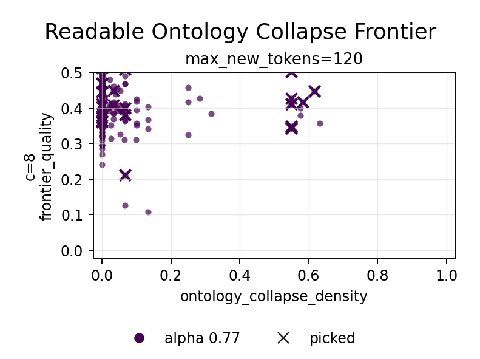

# Semantic Loop Guard for Mistral Reselection

This note follows the 12-seed model comparison probe.  The local Mistral
condition was unusually clean under the stock-hub gate, but its strongest
numerical examples exposed a different failure mode: compact semantic loops such
as `printer -> words -> book -> pages -> words -> printer`.

The new selector diagnostics separate that failure from ordinary token
repetition:

- `semantic_loop_pressure`: content-term recurrence inside the candidate.
- `lineage_diversity`: how many content terms are new relative to the recent
  context.
- `net_transport_score`: a readable diagnostic combining low loop pressure with
  lineage diversity.

The weights are optional, so old selector behavior is unchanged unless the user
passes the new flags.

## Post-Hoc Probe

The probe reuses the saved Mistral candidate pools without generating new text.

```bash
PYTHONPATH=src python3 -m depaysement_lab.cli reselect \
  experiments/frontier_sweep_model_compare_mistral7b_stock_guard_traj_seed12/steer_alpha_*.json \
  --out-dir experiments/posthoc_reselect_mistral7b_semantic_loop_guard_w1p6 \
  --select-objective banded-frontier \
  --choose best \
  --context-policy recorded \
  --include-original \
  --hard-unfinished-max 0.0 \
  --hard-ban-affordance-classes canonical_stock_hub \
  --soft-style-cliche-weight 0.35 \
  --fantasy-prop-weight 1.40 \
  --ordinary-anchor-weight 0.55 \
  --ordinary-anchor-min 0.35 \
  --semantic-loop-weight 1.6 \
  --lineage-diversity-weight 0.35 \
  --lineage-diversity-min 0.25 \
  --top-k 12
```

Artifacts:

- `experiments/posthoc_reselect_mistral7b_semantic_loop_guard_w1p6/posthoc_reselect_report.md`
- `experiments/posthoc_reselect_mistral7b_semantic_loop_guard_w1p6/posthoc_reselect_texts.md`
- `experiments/posthoc_reselect_mistral7b_semantic_loop_guard_w1p6/posthoc_reselect_candidates.csv`
- `experiments/posthoc_reselect_mistral7b_semantic_loop_guard_w1p6/posthoc_reselect.png`



## Result

With `semantic_loop_weight=1.6`, 7 of the 12 Mistral reselected runs changed at
least one picked step.  The most diagnostic change is seed 09, the printer run.

Original high-frontier pick:

```text
The book's pages rustle open, and the ink spills words. The printer's words become a book.
```

Metrics:

- frontier: `0.415`
- semantic loop: `0.675`
- net transport: `0.217`

Loop-guard pick:

```text
The book's pages hold secrets, and the ink spills words. The book opens as a garden.
```

Metrics:

- frontier: `0.170`
- semantic loop: `0.429`
- net transport: `0.429`

This is a useful tradeoff.  The highest local frontier point is still visible in
the candidate pool, but the selector no longer treats it as automatically best
when it is mostly returning to the same few objects.

## Interpretation

Mistral's stock guard is working: the failure is not `music box` or `porcelain`
leakage.  The model instead finds clean symbolic cycles that satisfy local
ontology-transition metrics while failing global transport.  A live selector for
Mistral therefore needs loop pressure more than more stock suppression.

The broader model-control picture becomes sharper:

- Gemma needs a stronger transition mechanism, not just higher alpha.
- Llama needs pool hygiene against stock and cliche attractors.
- Mistral needs semantic-loop pressure and lineage-aware transport scoring.

The next Mistral-specific pass should try the same guard during live generation,
then compare whether the candidate pool itself reroutes or whether only the
post-hoc selector changes.
