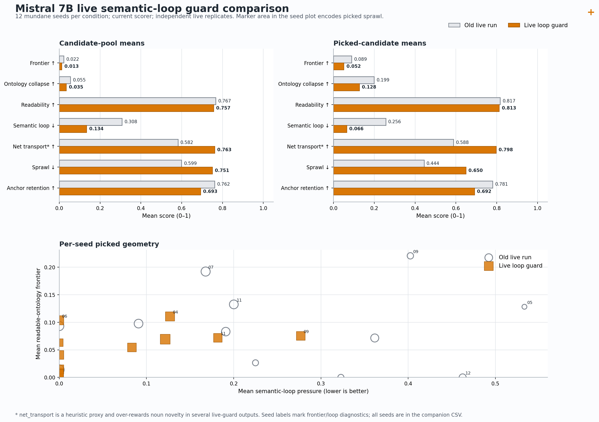

# Live Semantic Loop Guard for Mistral 7B

## Technical Summary

The live semantic-loop guard works as a loop suppressor, but it is not yet a
complete transport controller. Across 12 mundane seeds, picked semantic-loop
pressure fell from `0.256` to `0.066` (`-74.3%`) while picked readability stayed
nearly flat (`0.817` to `0.813`). The displaced failure pressure did not vanish:
picked sprawl rose from `0.444` to `0.650` (`+46.4%`), picked frontier fell from
`0.089` to `0.052` (`-42.3%`), and every live-guard trajectory stopped at step 3
with sprawl in the stop reason.

The qualitative result is mixed but useful. The printer seed escaped its old
`printer -> words -> book -> pages -> printer` cycle and produced a traceable
`printer -> garden -> flowers -> ink/violets/paper` transformation. Other seeds
escaped loops by accumulating unrelated nouns, nonce compounds, or stock-like
replacement props. The next selector should therefore distinguish **novelty
with lineage** from **novelty without a bridge**.

## Experimental Question

The post-hoc probe showed that `semantic_loop_weight=1.6` could choose a less
recursive candidate from an already saved Mistral pool. This live pass asks a
harder question:

> When loop-aware selection changes the picked context during generation, does
> the downstream candidate pool reroute toward readable semantic transport, or
> does Mistral transfer the failure into another basin?

The run used the same local Mistral model, steering vector, 12 mundane seeds,
alpha schedule, stock-hub hard gate, and trajectory controls as the larger model
comparison. Only the live selector gained semantic-loop and lineage-diversity
pressure.

```bash
PYTHONPATH=src python3 -m depaysement_lab.cli frontier-sweep \
  --backend mlx \
  --model /Users/ryospiralarchitect/SpiralReality/model/mistral7b-instruct-v0.3 \
  --chat-template \
  --vectors experiments/depaysement_mlx_vectors_mistral7b_it_v03_l4_18.npz \
  --steer-layers 4-18 \
  --strict-steering \
  --seed-bank data/mundane_seed_bank_en_v1.json \
  --seed-limit 12 \
  --steps 5 \
  --alphas 0.77 \
  --steer-schedule 0.55,0.72,0.72,0.58,0.45 \
  --candidate-grid 8 \
  --max-token-grid 120 \
  --select-objective banded-frontier \
  --choose best \
  --hard-unfinished-max 0.0 \
  --hard-ban-affordance-classes canonical_stock_hub \
  --soft-style-cliche-weight 0.35 \
  --fantasy-prop-weight 1.40 \
  --ordinary-anchor-weight 0.55 \
  --ordinary-anchor-min 0.35 \
  --semantic-loop-weight 1.6 \
  --lineage-diversity-weight 0.35 \
  --lineage-diversity-min 0.25 \
  --trajectory-stop \
  --trajectory-min-steps 3 \
  --trajectory-unfinished-stop-max 0.05 \
  --trajectory-repetition-stop-max 0.55 \
  --trajectory-sprawl-stop-max 0.65 \
  --adaptive-steering \
  --adaptive-steering-min-alpha 0.30 \
  --adaptive-steering-max-alpha 0.88 \
  --adaptive-steering-frontier-min 0.14 \
  --adaptive-steering-unfinished-max 0.05 \
  --adaptive-steering-loop-max 0.55 \
  --adaptive-steering-boost 0.06 \
  --adaptive-steering-dampen 0.12 \
  --out-dir experiments/frontier_sweep_mistral7b_live_semantic_loop_guard_seed12 \
  --resume
```

## The Guard Suppresses Loops but Transfers Failure into Sprawl

The old live run was rescored with the current scorer before comparison. Values
below pool all saved candidates or all picked candidates, rather than averaging
the 12 run means. This preserves the actual candidate denominator.

| metric | old pool | guard pool | delta | old picked | guard picked | delta |
|---|---:|---:|---:|---:|---:|---:|
| semantic loop | 0.308 | 0.134 | -56.3% | 0.256 | 0.066 | -74.3% |
| readable-ontology frontier | 0.022 | 0.013 | -41.0% | 0.089 | 0.052 | -42.3% |
| ontology collapse | 0.055 | 0.035 | -35.8% | 0.199 | 0.128 | -35.9% |
| readability | 0.767 | 0.757 | -1.3% | 0.817 | 0.813 | -0.5% |
| graph sprawl | 0.599 | 0.751 | +25.3% | 0.444 | 0.650 | +46.4% |
| anchor retention | 0.762 | 0.693 | -9.1% | 0.781 | 0.692 | -11.3% |
| net transport proxy | 0.582 | 0.763 | +31.0% | 0.588 | 0.798 | +35.6% |

The pool also shows small absolute increases in cliche (`0.018` to `0.044`),
stock-prop (`0.009` to `0.029`), and fantasy-prop (`0.010` to `0.034`)
pressure. Canonical hubs remained hard-gated at selection time, but replacement
motifs became more available in the rerouted pool.

The figure makes the exchange visible: live-guard points move sharply left on
semantic-loop pressure, but the selected frontier ceiling also moves down and
marker area grows because picked sprawl rises. The apparent net-transport gain
is not accepted at face value; several high-transport examples are noun drift.



The stopping reasons reinforce the same diagnosis. The old run stopped six
trajectories for sprawl, four for repetition, and two for frontier decay. The
live guard stopped all 12 at step 3 with sprawl in the reason; two also had
frontier decay. Loop pressure was not removed so much as redirected into object
proliferation and graph fragmentation.

## A Genuine Reroute: Printer to Garden

The most diagnostic success is seed 09, `I am waiting for the printer`.

```text
The printer hums within the garden.

I waits for the flowers, The garden hums within the flowers.

The printer's ink unfurls in the garden, and blooms a carpet of violets. The
flowers nurture the paper, their petals the printer's whispers.
```

The final step keeps `printer`, `ink`, and `paper` while opening a new organic
state through `garden`, `flowers`, and `violets`. Its metrics are frontier
`0.111`, semantic loop `0.231`, anchor retention `1.000`, and net transport
`0.673`. This is not loop elimination: step 2 briefly repeats `flowers`, with
loop pressure `0.600`. What matters is that the trajectory leaves that local
return and reaches a new, still traceable state.

Two other outputs support the same possibility:

- Seed 04: `mug -> waterfall -> spoon/shadow -> needles sewing a net` retains
  the sink/counter scene while changing object roles.
- Seed 12: `laundry basket -> wildflowers -> washing machine scented with suds`
  avoids the previous rose/window loop and preserves a domestic lineage.

These cases suggest that a useful trajectory may contain local recurrence. A
flat penalty on every repeated concept is therefore less faithful than a score
for whether recurrence eventually produces a new state.

## Three Failure Transfers

### Novelty without lineage

Seed 08 receives near-maximal net-transport scores while drifting through
`parsley`, `milk`, `lemon`, `mushrooms`, `scone`, `wine`, `pear`, and `peaches`.
The score reads new content terms as transport even when the fridge lineage is
barely traceable. Seed 02 is more severe: it reaches nonce compounds such as
`soapbuboons`, `darkfish`, `slugfish`, and `frothbellows` while reporting picked
net transport `0.878`.

### A transition followed by semantic stasis

Seed 06 begins strongly:

```text
The elevator button was cracked, and it had become a water fountain.
```

That step reaches frontier `0.284` with anchor retention `1.000`. The next two
steps only explain the new water/glass state and fall to frontier `0.027` and
`0.000`. The current within-candidate loop metric remains `0.000`, so it misses
a trajectory-level stall spread across several short continuations.

### Metric blind spots on real transformation

Seed 05 moves from a spreadsheet to a teapot's tongue, bluebird nests, and
marigolds. Human reading sees ontological transport, but the heuristic ontology
score is `0.000` at every picked step. The observer is still tied to a limited
set of explicit transformation patterns, so a lower measured frontier does not
always mean the generated text stopped transforming.

## Scope, Data Quality, and Causal Boundary

- Old condition: 12 seeds, 304 candidates, 38 picks.
- Live guard: 12 seeds, 288 candidates, 36 picks.
- Both audits contain 12 unique seeds, unique candidate keys, one pick per saved
  step, zero truncated steps, zero missing loop/lineage/transport metrics, and
  zero picked hard-gate violations.
- All live-guard runs stopped at step 3; the old condition had two four-step
  trajectories. The pooled comparison therefore uses candidates and picks as
  its denominators and reports the differing counts explicitly.
- The runs are independent stochastic replicates. Despite the same CLI random
  seed, their seed-07 step-1 candidate pools were different. MLX runtime state,
  library changes, or generation-order effects may be responsible. The aggregate
  differences are descriptive and diagnostic, not a paired causal estimate.
- `semantic_loop_pressure`, `lineage_diversity`, `net_transport_score`, ontology
  collapse, and sprawl are heuristic instruments. The text audit above is part
  of the evidence, not a decorative appendix.

## Next Controller: Traceable Transport

Increasing `semantic_loop_weight` again is unlikely to help. The live run shows
that Mistral can satisfy a loop penalty by abandoning lineage or multiplying
objects. The next selector should score a transition as useful only when it
contains both a bridge and a departure.

Candidate diagnostics to add:

1. `lineage_bridge`: retention of at least one salient object, relation, or
   affordance from the previous picked state, excluding generic scene words.
2. `trajectory_revisit_pressure`: recurrence of the same semantic state across
   the last two or three picked steps, not only repeated terms inside one
   candidate.
3. `unbridged_novelty`: high content novelty without a retained object/relation
   bridge; this should penalize noun soup and nonce-word escape.
4. `object_budget_pressure`: growth in disconnected objects relative to the
   previous state, complementing the existing absolute sprawl metric.
5. `traceable_transport_score`: readability times bridge retention times useful
   novelty times low trajectory revisit, with an explicit sprawl penalty.

A compact next probe should use seeds 04, 05, 09, and 12, where this run exposed
two readable reroutes, one metric blind spot, and one prior loop diagnostic. It
should compare lower loop weights (`0.8`, `1.1`, `1.4`) with a lineage bridge
gate and stronger sprawl control before returning to all 12 seeds.

## Artifacts

- Live report: `experiments/frontier_sweep_mistral7b_live_semantic_loop_guard_seed12/frontier_sweep_report.md`
- Generated texts: `experiments/frontier_sweep_mistral7b_live_semantic_loop_guard_seed12/frontier_sweep_texts.md`
- Candidate metrics: `experiments/frontier_sweep_mistral7b_live_semantic_loop_guard_seed12/frontier_sweep_candidates.csv`
- Current-scorer baseline audit: `experiments/frontier_audit_mistral7b_stock_guard_current_metrics/frontier_sweep_report.md`
- Pooled comparison: `experiments/mistral7b_live_semantic_loop_guard_compare/live_guard_summary.csv`
- Per-seed comparison: `experiments/mistral7b_live_semantic_loop_guard_compare/live_guard_by_seed.csv`
- Comparison manifest: `experiments/mistral7b_live_semantic_loop_guard_compare/live_guard_comparison.json`
- Comparison figure: `experiments/mistral7b_live_semantic_loop_guard_compare/live_guard_comparison.png`
