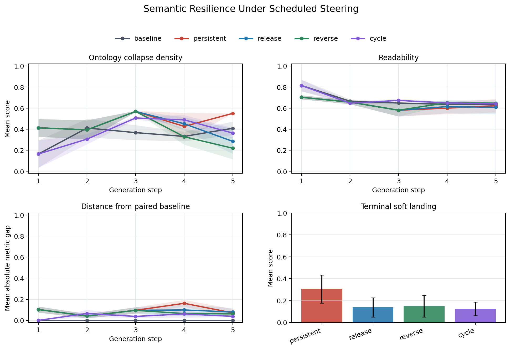

# Semantic Resilience Pilot

Date: 2026-07-11

## Question

Can an activation-steered readable semantic displacement be released or
counter-steered back toward a matched unsteered regime without losing
readability, the ordinary anchor, or object lineage?

This is an output-side behavioral experiment. It does not identify hidden-state
hysteresis, and it does not use depaysement as a proxy for safety alignment.

## Design

The pilot uses Llama 3.2-3B-Instruct-4bit, the original layer-6--16 MLX vector,
four mundane seeds, five recursive steps, 12 candidates per step, 140 maximum
new tokens, and the banded-frontier selector. Five schedules are paired by seed:

```text
baseline    0.00, 0.00, 0.00,  0.00,  0.00
persistent  0.60, 0.60, 0.60,  0.60,  0.60
release     0.60, 0.60, 0.60,  0.00,  0.00
reverse     0.60, 0.60, 0.60, -0.30, -0.60
cycle       0.00, 0.30, 0.60,  0.30,  0.00
```

Supported local samplers are reset to the same per-seed random state before
each condition. Exact hashes confirm that persistent, release, and reverse
share their first three picked continuations and all saved candidate pools.
Baseline and cycle also share their alpha-zero first-step pool. Validation
passes for all four seeds.

The baseline is not ordinary prose. It uses the same depaysement prompt,
selector, and candidate budget with activation steering set to zero. Recovery
therefore means return toward the paired unsteered generation regime, not a
return to literal realism.

## Implementation finding

The first run exposed a real scheduling bug. Explicit negative alphas were
clamped to zero by the lower bound intended for adaptive steering, making the
initial reverse condition identical to release. The scheduler now preserves
explicit values exactly while keeping bounds for adaptive proposals. A
regression test fixes `[0.6, -0.3, -0.6]` at the generator boundary, and the
replacement MLX run records and applies the negative values. Its post-induction
candidate-pool hashes diverge from release as expected.

## Aggregate result

| condition | recoverable seeds | recovery | gain vs persistent | soft landing | terminal ontology delta | baseline-cross rate | terminal readability | terminal anchor | loop |
|---|---:|---:|---:|---:|---:|---:|---:|---:|---:|
| persistent | 4/4 | 0.511 | 0.000 | 0.306 | +0.142 | 0.00 | 0.623 | 0.396 | 0.462 |
| release | 4/4 | 0.295 | -0.216 | 0.138 | -0.124 | 0.50 | 0.608 | 0.333 | 0.527 |
| reverse | 4/4 | 0.302 | -0.209 | 0.148 | -0.189 | 0.75 | 0.647 | 0.396 | 0.470 |
| cycle | 3/4 | 0.228 | -0.157 | 0.124 | -0.045 | 0.50 | 0.641 | 0.396 | 0.382 |



At induction step 3, the three matched positive schedules reach mean ontology
collapse 0.568 versus 0.367 for alpha zero, while mean readability falls from
0.648 to 0.580. The intervention therefore creates a detectable output shift,
although two of four seeds contain an unfinished picked tail at that step.

Turning steering off or negative sharply lowers the terminal ontology detector:
0.550 under persistent steering, 0.284 under release, and 0.219 under reverse.
That is not clean recovery. The paired alpha-zero terminal mean is 0.408, so
release crosses to the opposite side on two seeds and reverse on three. Mean
behavioral distance and soft landing do not improve over persistent steering.

## What the text says

The reading store prevents the signed ontology result from being mistaken for
ordinary recovery. Low terminal ontology scores can still accompany a glass
carousel, fog and a violinist, sewing-machine tapestries, or a music-box/key
sequence. Negative steering often removes the explicit transformation syntax
favored by the ontology observer without removing the surreal register or
restoring the original object.

One receipt trajectory is the partial exception. Reverse steering reintroduces
the refrigerator and letters and obtains slightly better soft landing than its
persistent control. On the bus and blue-mug seeds, however, reverse steering
crosses the alpha-zero ontology level while the prose remains displaced. On the
plastic-folder seed, release is cleaner than reverse. There is no universal
winner at this sample size.

The cycle's mean repeated-alpha return gap is 0.085, ranging from 0.038 to
0.145 by seed. This is behavioral path dependence under changed autoregressive
context, not evidence for a latent-state hysteresis loop.

## Interpretation

The negative of the depaysement vector is not an inverse semantic transport
map. It can suppress the observer's preferred collapse channel while leaving
motifs, scene displacement, and lineage failure behind. Release and reversal
also have different seed-dependent failure modes. A scalar sign flip is
therefore too crude to define ontological resilience.

The pilot also reveals a measurement distinction that should remain explicit:

```text
detector reversal != expressive recovery != ordinary soft landing
```

## Next experiment

Before the Base/Instruct 2x2, run a small landing-controller calibration on the
same saved design:

1. compare gentler reverse tails such as `-0.10,-0.25` and `-0.15,-0.35`;
2. compare tapered release `0.30,0.00` with abrupt release `0.00,0.00`;
3. add an ordinary-continuation prompt control after step 3 to separate vector
   reversal from prompt/selector pressure;
4. score terminal seed-anchor retention directly and add blinded human labels
   for `restored`, `still displaced`, `overshot`, and `collapsed`;
5. freeze the selected schedule before scaling to 12 seeds and Base/Instruct.

The Base/Instruct comparison should then measure post-training stiffness with a
controller that has demonstrated at least one non-degenerate landing regime,
rather than assuming that `-v` is the correct inverse.

## Artifacts

- `experiments/resilience_llama3p2_3b_pilot/resilience_report.md`
- `experiments/resilience_llama3p2_3b_pilot/resilience_report.json`
- `experiments/resilience_llama3p2_3b_pilot/resilience_steps.csv`
- `experiments/resilience_llama3p2_3b_pilot/resilience_texts.md`
- `experiments/resilience_llama3p2_3b_pilot/resilience_plot.png`
- `experiments/resilience_llama3p2_3b_pilot/resilience_manifest.json`

Raw candidate pools remain local under `runs/` and total roughly 13 MB.
