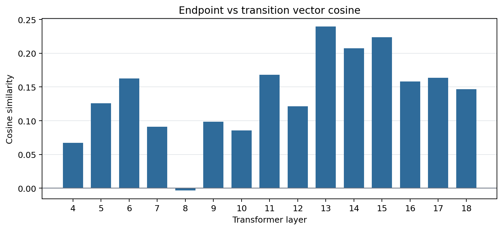
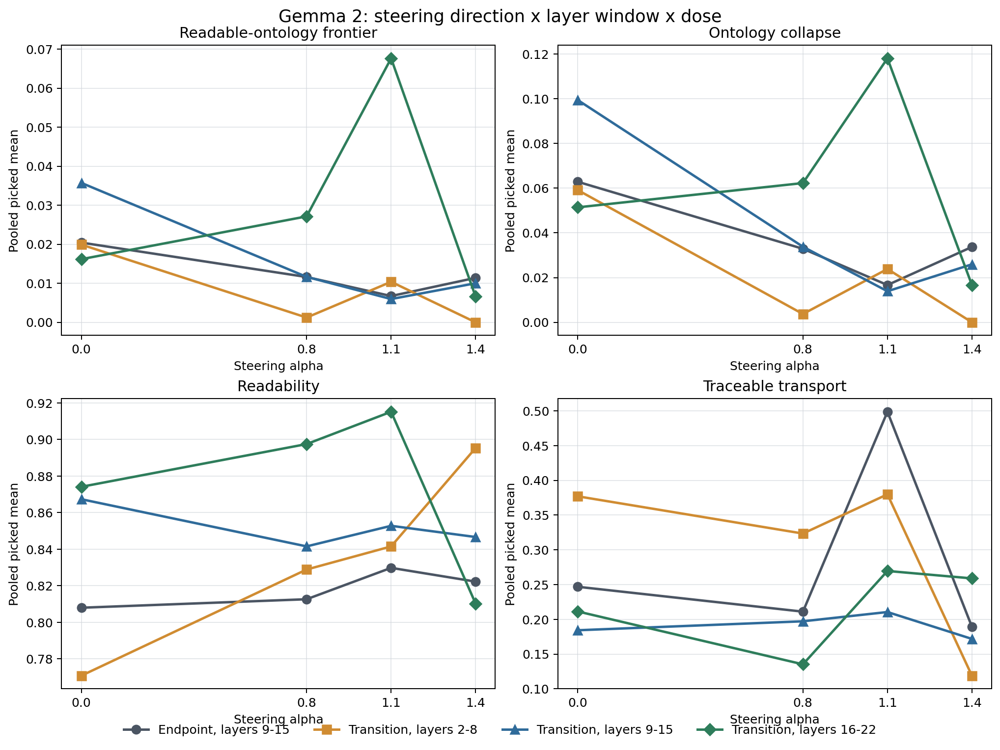
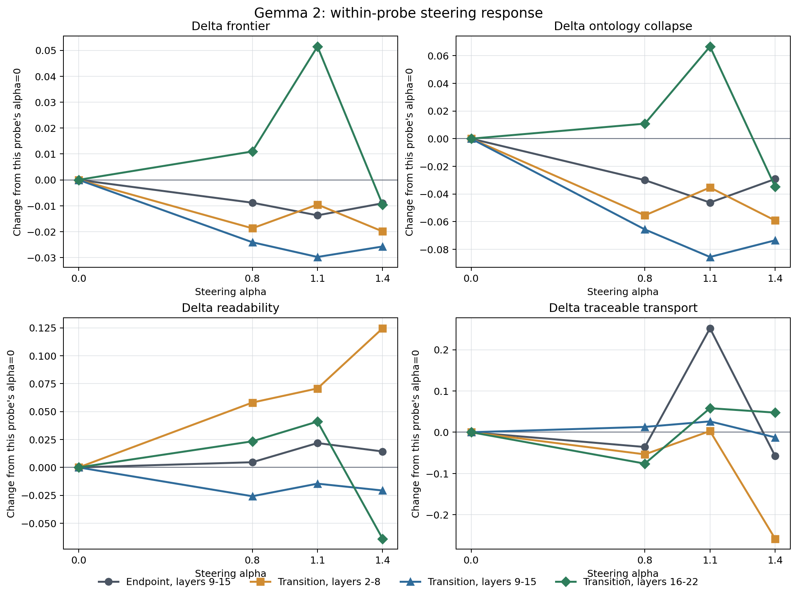

# Gemma 2 Transition-Vector Layer Probe

## Question

The 12-seed model comparison showed that Gemma 2 remained highly readable but
nearly ontologically static under a strong endpoint-surreal steering vector.
Increasing scalar alpha did not solve the problem. This probe asks whether the
missing control variable is the direction itself, its layer location, or both.

## Transition Contrast Bank

`data/depaysement_transition_bank_en_v1.json` contains 24 positive/negative
pairs built from mundane objects. Each pair reuses the same anchor and target
concepts. The positive sentence changes identity or affordance, while the
negative keeps an ordinary descriptive or spatial relation.

```text
positive:
The printer's ink opens into a garden; paths of paper remain visible between
the flowers.

negative:
The printer produces a picture of a garden; its ink dries on paper between the
printed flowers.
```

The bank contains no weird-noise negatives. This reduces the chance that the
estimated direction is primarily an anti-repetition or anti-noise direction.
The vector was collected over all 26 Gemma layers with last-token pooling:

```bash
PYTHONPATH=src python3 -m depaysement_lab.cli collect-mlx-vectors \
  --model mlx-community/gemma-2-2b-it-4bit \
  --bank data/depaysement_transition_bank_en_v1.json \
  --out experiments/depaysement_mlx_vectors_gemma2_transition_l0_25_last.npz \
  --layers 0-25 \
  --token-strategy last \
  --chat-template \
  --max-length 192 \
  --verbose
```

The archive checksum passed. The transition direction is not a small rewrite
of the original endpoint vector: across their 15 shared layers, mean cosine is
`0.137`, with range `-0.003` to `0.239`.



## Layer and Dose Design

Each layer window contains seven blocks:

| probe | vector | layers |
|---|---|---|
| endpoint-mid | original endpoint-surreal | 9-15 |
| transition-early | matched transition | 2-8 |
| transition-mid | matched transition | 9-15 |
| transition-late | matched transition | 16-22 |

All probes used the same four diagnostic mundane seeds, three autoregressive
steps, four candidates per step, 96 maximum new tokens, and static alpha values
`0, 0.8, 1.1, 1.4`. Steering remained decode-only. The selector matched the
earlier Gemma condition: banded frontier, hard unfinished max `0.05`, soft-style
weight `0.20`, fantasy-prop weight `0.60`, and ordinary-anchor weight `0.35`.

## Result



Because independent MLX runs do not produce perfectly paired alpha-zero pools,
the baseline-centered view is the cleaner visual diagnostic:



The endpoint direction and the early/middle transition windows do not create a
positive ontology response. Their picked ontology means generally fall as alpha
increases. The late transition window is different. At `alpha=1.1`, relative to
its own alpha-zero run:

| metric | alpha 0 | alpha 1.1 | delta |
|---|---:|---:|---:|
| picked frontier | 0.016 | 0.068 | +0.051 |
| picked ontology | 0.051 | 0.118 | +0.067 |
| picked readability | 0.874 | 0.915 | +0.041 |
| picked traceable transport | 0.211 | 0.270 | +0.058 |

The response is narrow. At `alpha=1.4`, the frontier and ontology gains vanish
and readability falls. At the same `alpha=1.1` in middle layers, the original
endpoint vector moves ontology in the opposite direction (`0.063 -> 0.017`).

This is evidence for a direction- and layer-specific Gemma response, not a
monotonic dose effect.

## Seed Decomposition

The pooled late-window peak combines different seed behaviors:

| seed | frontier delta | ontology delta | readability delta |
|---|---:|---:|---:|
| blue mug | +0.048 | -0.009 | +0.211 |
| printer | +0.038 | +0.092 | +0.006 |
| laundry basket | +0.120 | +0.183 | -0.098 |
| spreadsheet | +0.000 | +0.000 | +0.045 |

The printer is the cleanest numerical response because ontology rises while
readability stays nearly flat. The laundry gain carries a readability cost. The
mug gain is mostly readability recovery, and the spreadsheet remains resistant.

## Textual Audit

The high-scoring late-window examples are not all strong depaysement:

```text
The rose, now a lone, red bloom, spills over the edge of the sink.

The shoe, now a purple shoe, turned a shade of white in its shine.
```

These trigger explicit identity/state patterns and remain readable, but the
first is a modest affordance shift and the second is mostly a color change. The
same run also drifts through `cat`, `rose`, and `book/notebook` motifs. A
traceable-transport post-hoc reselection over the exact late `alpha=1.1` pools
does not remove these central examples. The limitation is therefore in the
available candidate pool and observer construct, not only in the old selector.

## What the Probe Establishes

1. The matched transition vector is geometrically distinct from the endpoint
   vector.
2. Gemma has a narrow late-layer response around `alpha=1.1` that the endpoint
   vector does not reproduce.
3. The response is not yet a reliable readable-depaysement corridor across
   seeds.
4. Observer maxima still overvalue shallow color/state substitutions, so raw
   text exposure remains necessary.

## Next Vector Revision

The collection design reveals a likely technical mismatch. The vector uses
last-token pooling, but most positive/negative pairs place the transformation in
the first clause and the anchor-preservation relation at the end. The captured
last state may therefore emphasize preserved scene context more than the
transition predicate.

The next bank should be predicate-terminal and lexically matched:

```text
positive: The printed total stays visible on every step; the receipt becomes the staircase.
negative: The printed total stays visible on every step; the receipt lies on the staircase.
```

That revision tests whether a token-aligned relation direction strengthens the
late-layer response without merely opening a stock-prop or color-substitution
basin. It should be evaluated first on the resistant spreadsheet seed and the
cleaner printer seed before another 12-seed confirmation.

## Causal Boundary

- Four seeds, four alpha values, three steps, and four candidates yield 192
  saved candidates per probe and 48 picks across all doses.
- Alpha-zero conditions are independent stochastic runs, not a shared paired
  candidate pool. Within-probe deltas are descriptive response estimates.
- The vector contrast is controlled more tightly than the original bank, but it
  still contains researcher-chosen object relations.
- All observer metrics are deterministic heuristics. The picked-text store is
  part of the result, not an appendix to be ignored.

## Artifacts

- Summary report: `experiments/gemma2_transition_layer_probe_seed4/gemma_transition_report.md`
- Dose-response figure: `experiments/gemma2_transition_layer_probe_seed4/gemma_transition_dose_response.png`
- Baseline-centered figure: `experiments/gemma2_transition_layer_probe_seed4/gemma_transition_delta_response.png`
- Vector cosine figure: `experiments/gemma2_transition_layer_probe_seed4/gemma_transition_vector_cosine.png`
- Pooled metrics: `experiments/gemma2_transition_layer_probe_seed4/gemma_transition_summary.csv`
- Per-seed metrics: `experiments/gemma2_transition_layer_probe_seed4/gemma_transition_by_seed.csv`
- Picked text store: `experiments/gemma2_transition_layer_probe_seed4/gemma_transition_picked_texts.md`
- Machine-readable summary: `experiments/gemma2_transition_layer_probe_seed4/gemma_transition_summary.json`
- Traceable reselection: `experiments/gemma2_transition_late_alpha1p1_traceable_reselect/`
