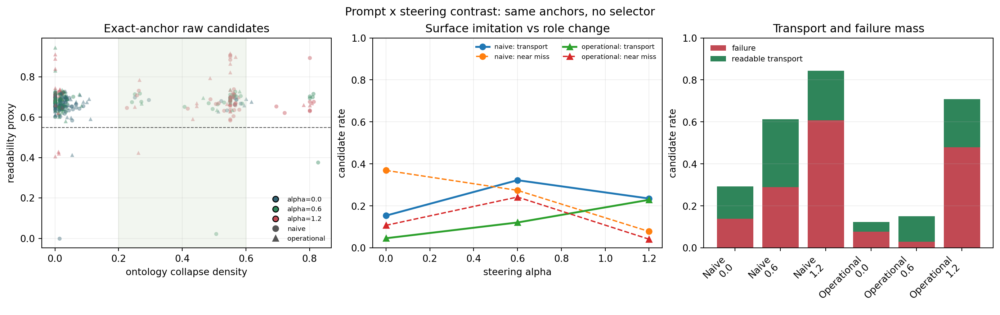

# Prompt x Steering Contrast: Surface Imitation, Role Change, and Failure Control

Date: 2026-07-12

## Question

Can an instruction-tuned language model be made to transform what familiar
objects are and do, rather than merely decorate them with surreal language?

The comparison gives prompting a strong baseline. It does not compare steering
against ordinary continuation or an intentionally vague prompt. Every condition
must retain the same four named anchors. Two prompt modes are crossed with three
steering values:

| prompt | instruction |
|---|---|
| naive | make the scene surreal through depaysement while preserving the named things |
| operational | change at least one named thing's identity, role, affordance, or concrete relation; do not merely decorate or explain |

Both prompts share the same output-only, completion, scene-continuity, and exact
anchor-phrase requirements. The alpha grid is `0`, `0.6`, and `1.2`.

## Design

- model: `mlx-community/Llama-3.2-3B-Instruct-4bit`;
- vector: the primary Llama depaysement contrast, blocks 6--16;
- injection: last position, decode only;
- 12 mundane scenes with four explicit anchor phrases each;
- one generation step, eight candidates per cell, 120 maximum new tokens;
- two prompt modes x three alphas x 12 seeds = 72 cells and 576 candidates;
- temperature `1.05`, top-p `0.92`;
- identical per-seed MLX RNG reset in every condition;
- no selector: every reported condition statistic is computed over the raw pool.

The RNG reset removes one preventable source of sampling drift. Once logits
diverge, candidate token paths are not paired counterfactuals. Statistical
summaries therefore aggregate within each seed and bootstrap the 12 seed-level
differences rather than treating 96 candidates as independent observations.

## Raw-Pool Result

| prompt | alpha | N | full-anchor rate | ontology | readability | decorative near miss | readable transport | failure |
|---|---:|---:|---:|---:|---:|---:|---:|---:|
| naive | 0.0 | 96 | 0.677 | 0.091 | 0.662 | 0.344 | 0.125 | 0.188 |
| naive | 0.6 | 96 | 0.646 | 0.206 | 0.674 | 0.250 | 0.219 | 0.427 |
| naive | 1.2 | 96 | 0.531 | 0.392 | 0.651 | 0.052 | 0.198 | 0.708 |
| operational | 0.0 | 96 | 0.677 | 0.059 | 0.669 | 0.073 | 0.052 | 0.177 |
| operational | 0.6 | 96 | 0.688 | 0.086 | 0.692 | 0.208 | 0.125 | 0.104 |
| operational | 1.2 | 96 | 0.500 | 0.299 | 0.712 | 0.031 | 0.167 | 0.625 |

The naive instruction allows steering to move harder: at `alpha=0.6`, mean
ontology rises by `0.115` and readable-transport rate rises by `0.094`, but
failure rises by `0.240`. The operational instruction produces a smaller
transition response at the same alpha, while failure falls by `0.073`.

This is not a simple "prompting fails, steering succeeds" result. Prompting and
steering perform different control functions. The operational prompt constrains
what must survive; steering supplies transition pressure. At moderate alpha the
constraint keeps more of the pool out of failure. At high alpha the constraint
is overwhelmed.

## Exact-Anchor Comparison

To isolate relational change from vocabulary replacement, a second analysis
retains only candidates containing every required anchor phrase.

| prompt | alpha | matched N | ontology | readability | near miss | readable transport | failure |
|---|---:|---:|---:|---:|---:|---:|---:|
| naive | 0.0 | 65 | 0.113 | 0.654 | 0.369 | 0.154 | 0.138 |
| naive | 0.6 | 62 | 0.264 | 0.670 | 0.274 | 0.323 | 0.290 |
| naive | 1.2 | 51 | 0.444 | 0.692 | 0.078 | 0.235 | 0.608 |
| operational | 0.0 | 65 | 0.058 | 0.667 | 0.108 | 0.046 | 0.077 |
| operational | 0.6 | 66 | 0.074 | 0.688 | 0.242 | 0.121 | 0.030 |
| operational | 1.2 | 48 | 0.313 | 0.692 | 0.042 | 0.229 | 0.479 |

The exact-anchor filter does not manufacture equal pool sizes; matching rates
range from `0.500` to `0.688`. Raw compliance is retained above rather than
hidden. Within the matched subset, the prompt x corridor interaction is
especially informative:

| interaction metric | seed-paired mean | bootstrap 95% CI |
|---|---:|---:|
| ontology gain under operational vs naive prompt | -0.145 | [-0.236, -0.054] |
| readable-transport gain under operational vs naive prompt | -0.133 | [-0.294, +0.032] |
| failure gain under operational vs naive prompt | -0.224 | [-0.364, -0.094] |

The operational prompt reliably attenuates the steering-induced ontology shift
and the associated failure increase. Its effect on readable transport remains
uncertain at 12 seeds. This supports a regulator interpretation, not a claim
that prompt engineering and activation steering are equivalent.

Within the naive exact-anchor subset, medium steering increases readable
transport by `0.200` with seed-bootstrap CI `[0.048, 0.336]`, while failure also
increases by `0.180` with CI `[0.075, 0.284]`. Under the operational prompt, the
corresponding transport change is `+0.067` with CI `[-0.047, 0.188]`, and the
failure change is `-0.044` with CI `[-0.107, 0.012]`. The operational condition
therefore looks more regulated, but its medium-alpha transport gain is not yet a
confirmatory result.

The strongest high-alpha result is less ambiguous. Relative to operational
`alpha=0.6`, exact-anchor `alpha=1.2` increases ontology by `0.285` with seed
bootstrap CI `[0.200, 0.372]`, while failure increases by `0.545` with CI
`[0.307, 0.774]`. More transformation pressure is not more usable depaysement.

## Same-Seed Triptych

All three passages below use the operational prompt and retain `apartment key`,
`windowsill`, `plant pot`, and `blinds` exactly.

### Prompt only, alpha 0

> The apartment key remained, once again, forgotten, this time on the
> windowsill between the small, antique teacup now housing a single, wilted fern
> and the half-closed blinds that had never been fully raised. Nearby, the
> once-familiar plant pot now sat empty and dusty, a faint scent of fresh
> lavender still clinging to its ceramic rim.

The prose is decorated and mildly atmospheric, but the named objects retain
ordinary roles. The observer labels it ontologically stable.

### Corridor, alpha 0.6

> As the apartment key, once a trusted companion, now collects dust and a small
> inscription on its surface whispers forgotten promises, a forgotten briefcase
> with a faded label lies on the windowsill, between the same plant pot that has
> been watering the office plants of a distant tenant, and the half-closed
> blinds filter the afternoon sun.

The key acquires voice and the plant pot acts across distance while all four
anchors remain traceable. The observer labels it readable transport.

### High pressure, alpha 1.2

> As morning light creeps in, the apartment key, now a small, delicate key,
> subtly opens, and a sliver of morning light begins to seep into the apartment,
> casting an ethereal glow on the windowsill, where a small, antique globe, once
> a plant pot, now subtly begins to grow, its leaves unfolding like tiny,
> delicate fans, above the half-closed blinds, where a small, leather-bound book,
> once a desk, begins to write, its ink scribing a morning sonnet, as the blinds
> creak open, releasing a warm, morning mist.

Identity and affordance changes are abundant, but the passage recruits the same
antique, leather-bound, delicate, and mist register observed in earlier stock
attractors. The observer labels it a stock/loop/sprawl failure.

## Measurement Boundary

The triptych is illustrative and was selected deterministically from one seed
whose three operational cells contained the preferred observer categories with
all anchors present. Condition claims use all 12 seed pools.

The output observer still misses implicit or syntactically unusual role changes.
For example, it under-scores a comb that rights itself, hums, and silences the
morning light. A 36-item blinded construct sheet therefore separates five human
questions: anchor traceability, role/affordance change, mere decoration,
readability, and stock/loop/sprawl failure. Those ratings are pending and must
precede a confirmatory claim that the machine category equals literary
depaysement.

## Artifacts

- report: `experiments/prompt_steering_contrast_llama3p2_seed12/prompt_steering_report.md`
- compact summary: `experiments/prompt_steering_contrast_llama3p2_seed12/prompt_steering_summary.json`
- candidate table with all prose: `experiments/prompt_steering_contrast_llama3p2_seed12/prompt_steering_candidates.csv`
- full reading store: `experiments/prompt_steering_contrast_llama3p2_seed12/prompt_steering_texts.md`
- same-seed triptych: `experiments/prompt_steering_contrast_llama3p2_seed12/prompt_steering_triptych.md`
- seed-paired contrasts: `experiments/prompt_steering_contrast_llama3p2_seed12/prompt_steering_paired_contrasts.csv`
- blinded human sheet: `experiments/prompt_steering_contrast_llama3p2_seed12/human_construct_rating.md`
- condition key: `experiments/prompt_steering_contrast_llama3p2_seed12/human_construct_rating_key.json`
