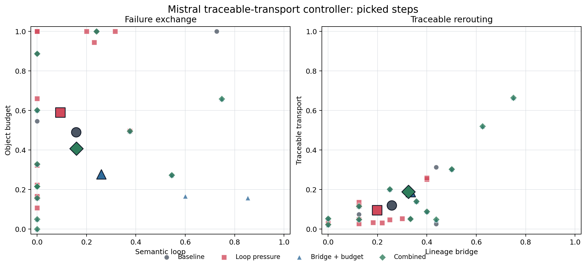

# Traceable Transport Controller for Mistral 7B

## Technical Summary

The previous semantic-loop guard reduced recurrence but transferred failure into
noun proliferation and graph sprawl. This follow-up adds a second control axis:
new objects receive credit only when they remain connected to recent lineage,
and disconnected object growth is penalized. The resulting observer separates
four quantities that the earlier net-transport proxy conflated:

- `lineage_bridge`: new objects connected to a recent object in the candidate relation graph;
- `trajectory_revisit_pressure`: return to a recent object-relation state;
- `unbridged_novelty`: new object mass outside a component containing recent lineage;
- `object_budget_pressure`: excess disconnected object and component growth.

Their composite, `traceable_transport_score`, rewards bridged relation novelty
while discounting within-candidate loops, trajectory revisit, and object growth.
The implementation is deliberately lexical and relation-graph based. It does
not use embeddings, a dependency parser, or an LLM judge.

## Fixed-Pool Calibration

The first calibration rescored the same saved 12-seed Mistral candidate pools
under a `loop x bridge-budget` selector grid. This holds generated text fixed
and changes only selection pressure.

| condition | N picked | frontier | read | loop | revisit | bridge | unbridged | budget | traceable |
|---|---:|---:|---:|---:|---:|---:|---:|---:|---:|
| baseline | 38 | 0.089 | 0.817 | 0.256 | 0.183 | 0.538 | 0.320 | 0.161 | 0.287 |
| loop | 38 | 0.080 | 0.826 | 0.174 | 0.092 | 0.471 | 0.416 | 0.213 | 0.295 |
| bridge-budget | 38 | 0.084 | 0.794 | 0.258 | 0.162 | 0.664 | 0.233 | 0.100 | 0.381 |
| combined | 38 | 0.080 | 0.798 | 0.198 | 0.137 | 0.620 | 0.254 | 0.117 | 0.394 |

Loop pressure alone lowers recurrence but weakens lineage and increases
unbridged novelty. Bridge-budget pressure alone improves lineage and object
economy but can prefer a compact semantic cycle. The combined selector retains
most of the bridge-budget improvement while reducing loop and revisit pressure.

The fixed-pool result is a selector calibration, not evidence that future live
candidate pools will improve. It cannot alter the context that generated later
saved pools.

## Compact Live Factorial

A compact live probe used four diagnostic seeds selected from the previous
12-seed run:

1. `A blue mug near the sink`: readable reroute followed by sprawl;
2. `The spreadsheet was still open`: observer blind spot followed by nonce drift;
3. `I am waiting for the printer`: prior semantic loop and lineage loss;
4. `The laundry basket by the door`: domestic lineage with a plausible reroute.

All conditions used Mistral 7B Instruct v0.3, the same steering vector and layer
window, a fixed three-step schedule (`0.55, 0.72, 0.72`), four candidates per
step, and 96 maximum new tokens. The common command body was:

```bash
PYTHONPATH=src python3 -m depaysement_lab.cli frontier-sweep \
  --backend mlx \
  --model /Users/ryospiralarchitect/SpiralReality/model/mistral7b-instruct-v0.3 \
  --chat-template \
  --vectors experiments/depaysement_mlx_vectors_mistral7b_it_v03_l4_18.npz \
  --steer-layers 4-18 \
  --strict-steering \
  --seed-bank data/traceable_transport_diagnostic_seeds_en_v1.json \
  --steps 3 \
  --alphas 0.77 \
  --steer-schedule 0.55,0.72,0.72 \
  --candidate-grid 4 \
  --max-token-grid 96 \
  --select-objective banded-frontier \
  --choose best \
  --hard-unfinished-max 0.0 \
  --hard-ban-affordance-classes canonical_stock_hub \
  --soft-style-cliche-weight 0.35 \
  --fantasy-prop-weight 1.40 \
  --ordinary-anchor-weight 0.55 \
  --ordinary-anchor-min 0.35 \
  --random-seed 20260712 \
  --out-dir CONDITION_OUT_DIR
```

The loop condition added:

```text
--semantic-loop-weight 0.9
--trajectory-revisit-weight 0.7
```

The bridge-budget condition added:

```text
--lineage-bridge-weight 0.9
--lineage-bridge-min 0.25
--traceable-transport-weight 1.1
--unbridged-novelty-weight 0.8
--object-budget-weight 0.8
```

The combined condition used both sets.

## Live Results

| condition | N picked | frontier | read | loop | revisit | bridge | unbridged | budget | traceable |
|---|---:|---:|---:|---:|---:|---:|---:|---:|---:|
| baseline | 12 | 0.040 | 0.784 | 0.157 | 0.055 | 0.258 | 0.697 | 0.490 | 0.120 |
| loop | 12 | 0.051 | 0.750 | 0.093 | 0.024 | 0.198 | 0.791 | 0.590 | 0.097 |
| bridge-budget | 12 | 0.037 | 0.767 | 0.260 | 0.077 | 0.334 | 0.585 | 0.277 | 0.188 |
| combined | 12 | 0.039 | 0.793 | 0.159 | 0.070 | 0.325 | 0.607 | 0.407 | 0.189 |



The live probe reproduces the failure exchange:

- Loop pressure lowers picked semantic-loop pressure by `0.064`, but raises
  unbridged novelty by `0.094` and object-budget pressure by `0.100`.
- Bridge-budget pressure lowers unbridged novelty by `0.112` and object-budget
  pressure by `0.213`, but raises semantic-loop pressure by `0.103`.
- The combined condition keeps readability flat-to-higher (`+0.009`), raises
  bridge by `0.068`, lowers unbridged novelty by `0.089`, and raises traceable
  transport by `0.068` relative to baseline. It does not eliminate all failure.

The `laundry basket` trajectory is the clearest positive example. Bridge and
combined selection preserve a visible domestic lineage:

```text
A door ajar, its hinges become a washer. The sunbeam struggles through the
basket, drying clothes.

Clothes driies on the door, swallows its shadow. A shirt on the washer.
```

The continuation still contains a misspelling, but the object transformation is
traceable and the object set remains compact. By contrast, the loop-only printer
trajectory avoids recurrence through nonce objects such as `ash-oat`, `snowfly`,
and `ribblower`; this is exactly the failure transfer the new metrics target.

## Search-Budget Boundary

The combined controller does not rescue the mug or spreadsheet trajectories at
`c=4`. For the spreadsheet seed, bridge-budget selection collapses into a compact
`silverprint -> moon -> glimmer -> silverprint` loop. Combined selection rejects
that loop but returns to nonce-heavy sprawl. Inspection of all four candidates
shows no candidate that is simultaneously low-loop, low-budget, bridged, and in
the ontology target band.

This is an infeasible-pool result, not evidence that stronger selector weights
will help. The next Mistral confirmation should cross controller condition with
candidate budget (`c=4, 8, 12`) on the mug and spreadsheet seeds. If combined
selection improves only when `c` grows, candidate search rather than controller
form is the limiting factor.

## Observer Blind Spot

The spreadsheet first step is readable and visibly transformative:

```text
The spreadsheet had begun to dance upon the table, turned to silver.
```

The lexical graph under-connects this sentence because the elided subject of
`turned to silver` is not recovered across the comma. This example should enter
the observer challenge set. A transparent clause-subject heuristic may repair
it, but any change must be tested against false bridges in noun-heavy clauses.

## Causal and Reproducibility Boundary

- Each condition contains four seeds, 48 saved candidates, and 12 picks.
- All picked outputs pass the unfinished and canonical-stock hard gates.
- The fixed-pool post-hoc comparison changes only selector pressure.
- The live comparison changes future prompts through each picked continuation.
- Despite the same CLI random seed, MLX step-1 candidate pools were not identical
  across every independent condition run. The reported 2x2 interaction is a
  descriptive contrast of controller-conditioned trajectories, not a paired or
  independent causal estimate.
- All reported metrics are deterministic heuristic observer outputs. The full
  picked text store is part of the evidence and should be human-audited before
  confirmatory claims.

## Artifacts

- Factorial report: `experiments/mistral7b_traceable_factorial_seed4_compact/factorial_report.md`
- Picked text store: `experiments/mistral7b_traceable_factorial_seed4_compact/factorial_picked_texts.md`
- Pooled summary: `experiments/mistral7b_traceable_factorial_seed4_compact/factorial_summary.csv`
- Per-seed summary: `experiments/mistral7b_traceable_factorial_seed4_compact/factorial_by_seed.csv`
- Interaction table: `experiments/mistral7b_traceable_factorial_seed4_compact/factorial_interactions.csv`
- Comparison plot: `experiments/mistral7b_traceable_factorial_seed4_compact/factorial_plot.png`
- Machine-readable bundle: `experiments/mistral7b_traceable_factorial_seed4_compact/factorial_summary.json`
